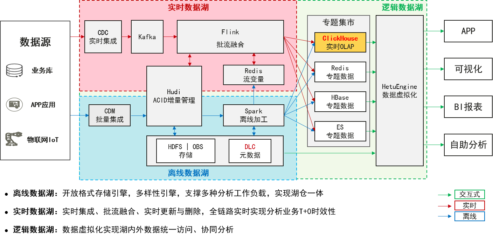
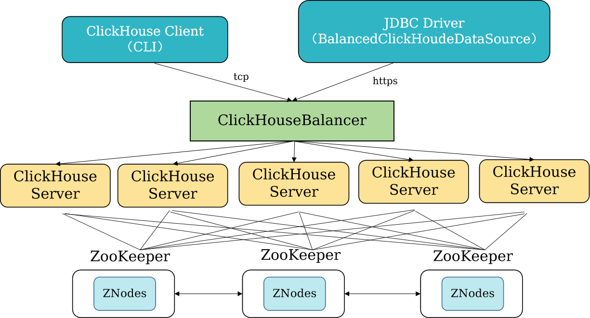
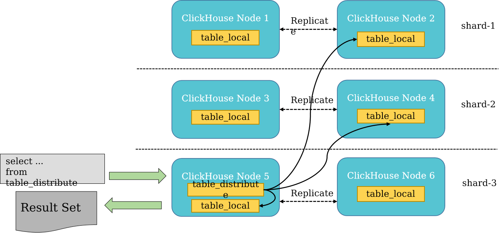

# ClickHouse联机分析数据库管理系统

**OLAP列式数据库管理系统**

ClickHouse**独立**于Hadoop大数据体系，最核心的特点是**极致压缩率和极速查询性能**。同时，ClickHouse支持SQL查询，且查询性能好，特别是基于大宽表的聚合分析查询性能非常优异，比其他分析型数据库速度快一个数量级。 

## ClickHouse应用场景

|       适用场景       |      不适用场景      |
| :------------------: | :------------------: |
|   网络/APP流量分析   |         OLTP         |
|   用户行为记录分析   |  Key-Value高频访问   |
|  人群预估、人群画像  |       文档存储       |
|    商业智能（BI）    |     非结构化数据     |
|       监控系统       |   点查（稀疏索引）   |
| 大宽表，单表聚合查询 | 频繁更新和删除的场景 |

## ClickHouse架构

- ClickHouseServer：ClickHouse服务，面向OLAP分析处理的列式数据库，提供**完备的DBMS功能，支持列式存储和数据压缩、向量化执行引擎、关系模式与SQL查询、数据分片与分布式查询**。
- ClickHouseBalancer：ClickHouse Balancer服务，支持ClickHouse Server的**负载分担及高可靠能力**。ClickHouseBalancer支持对多个ClickHouseServer进行负载均衡，提高应用接入的高可靠性。
- ClickHouse提供**TCP、HTTP**两种访问协议，支持**CLI客户端和JDBC客户端**访问。
- ClickHouseServer提供ClickHouse开源Server能力，利用Zookeeper，通过ReplicatedMergeTree引擎（Replicated系列引擎）实现了多主架构的副本机制。
- ClickHouse依赖ZooKeeper实现分布式DDL执行，支持ReplicatedMergeTree表主备节点之间的状态同步

## 表引擎

- 表引擎在ClickHouse中的作用十分关键，不同的表引擎决定了：
  - 数据存储和读取的位置
  - 支持哪些查询方式
  - 能否并发式访问数据
  - 能不能使用索引
  - 是否可以执行多线程请求
  - 数据复制使用的参数
- ClickHouse的表引擎一般常见的主要有五种，分别是**TinyLog、Memory、MergeTree、ReplacingMergeTree以及SummingMergeTree。**决定如何存储表数据
  - MergeTree（合并树）及其系列（*MergeTree）是ClickHouse用于高负载任务的最通用和功能最强大的表引擎，被设计**用于插入大量数据到一张表中**。数据以**数据块的形式**被快速写入，数据块在后台会进行异步合并，确保高效的插入和查询性能。
  - 主要支持的功能点有：
    - 主键排序、稀疏索引
    - 支持数据分区
    - 支持副本机制（ReplicatedMergeTree系列）
    - 支持数据采样
    - 并发数据访问
    - 支持TTL（Time To Live，数据的存活时间，到期自动删除）
    - 支持二级索引（Data Skipping Index跳数索引）

## 数据分片和副本

- 数据层面区分
  - 假设ClickHouse的N个节点组成了一个集群，在集群的各个节点上，都有一张结构相同的数据表Y。如果N1的Y和N2的Y中的**数据完全不同**，则N1和N2互为分片；如果它们的**数据完全相同**，则它们互为副本。换言之，分片之间的数据是不同的，而副本之间的数据是完全相同的。
- 功能作用层面区分
  - 使用副本的主要目的是**防止数据丢失**，增加数据存储的冗余；而使用分片的主要目的是实现**数据的水平切分**。

## ClickHouse副本的特点

- 表级别的副本，每张表的副本配置都可以按照它的实际需求进行个性化，包括副本的数量以及副本在集群内的分布式位置等。
- 依赖Zookeeper的分布式协同能力，以实现多个副本之间的数据同步。
- 多主架构，任意副本上执行INSERT和ALTER查询效果相同，这些操作会借助Zookeeper的协调能力被分发至每个副本以本地形式执行。
- 写入数据根据max_insert_block_size大小将数据切分成若干Block数据块，Block数据块是数据写入的基本单元，并且具有写入的原子性和唯一性。
  - 原子性：Block数据块数据全部写入成功或全部失败。
  - 唯一性：Block数据块根据数据顺序、数据行、数据大小等指标，计算Hash信息摘要，避免异常原因导致的Block数据块重复写入。

## 分布式查询

- ClickHouse通过分片和分布式表机制提供了线性扩展的能力。
- 分片机制：用来解决单节点的性能瓶颈，通过将数据进行水平切分，将一张表中的数据拆分到多个节点，不同节点之间的数据没有重复，这样就可以通过增加分片对ClickHouse进行线性扩展。
- 分布式表：在查询分片的数据时，通过分布式表进行查询，**分布式表引擎自身不存储任何数据**，仅是一层代理，能够自动路由到集群中的各个分片节点获取数据，即**分布式表需要和其他数据表一起协同工作**。

## 增强特性

- 可视化运维
  - 提供ClickHouse安装配置、启停、客户端、70+项监控告警指标、健康检查等可视化运维手段，使得ClickHouse更易维护，操作更加简便。
  - 实现日志级别可视化配置动态生效、可视化下载及检索、增加审计日志功能，提高问题定位效率
- 在线扩容和数据迁移
  - 实现在线扩容和可视化数据迁移，支持单表按节点、支持网络限速、支持进度查看、结果查看。
- 滚动升级/滚动重启
- 自动集群拓扑及ZK防止过载
  - Quota超过80%告警，超过100%禁止SQL执行
- 周边生态对接
  - 可以接收数据迁移