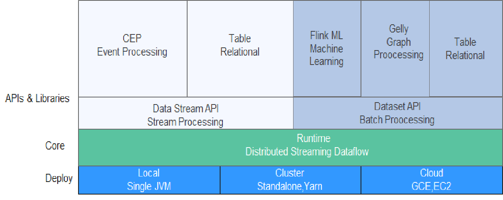
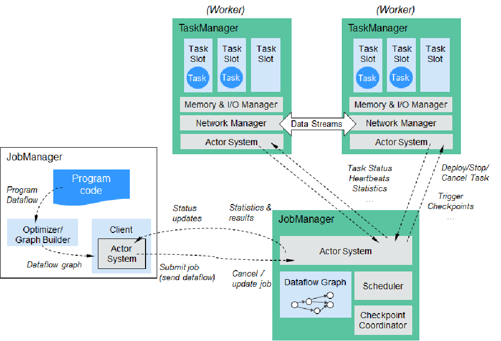

# Flink流批一体分布式实时处理引擎

Apache Flink是为分布式、高性能的流处理应用程序打造的**开源流处理框架**。Flink不仅能提供同时支持高吞吐和**exactly-once**语义的**实时计算**，还能提供**批量数据处理**。

相较于市面上的其他数据处理引擎，**Flink和Spark都可以同时支持流处理和批处理**。但是，**Spark的技术理念是基于批处理来模拟流的计算；而Flink则完全相反，它采用的是基于流计算来模拟批处理**。

- Flink与其他流计算引擎的最大区别，就是**状态管理**。
- Flink提供了内置的状态管理，可以把这些状态**存储在Flink内部**，而不需要把它存储在外部系统。这样做的好处：
  - 降低了计算引擎对外部系统的依赖，使得部署、运维更加简单；
  - 对性能带来了极大的提升。

## Flink Runtime整体架构

- Flink是一个分层架构的系统，主要分为三层，每一层所包含的组件都提供了特定的抽象，**用来服务上层组件**。部署层面上，可以**单机，集群，云上部署**，一般YARN集群部署比较多；核心层面上，有一个分布式的流式数据处理引擎；API层面上，有**流式处理API，批处理API**。**流式处理支持事件处理，表操作。批处理支持机器学习，图计算，也支持表操作**。
- Flink提供了三种部署方案local，Cluster，Cloud即：本地部署，集群部署和云部署。
- Runtime层是Flink流处理以及批处理时共用的一个引擎，以JobGraph形式接收程序。JobGraph即为一个一般化的并行数据流图（data flow），它拥有任意数量的Task来接收和产生data stream。
- DataStream API和DataSet API都会使用**单独编译**的处理方式生成JobGraph。DataSet API使用**optimizer来决定针对程序的优化方法**，而DataStream API则**使用stream builder来完成该任务**。
- Table API:对结构化数据进行查询操作，将结构化数据抽象成关系表，并通过SQL的DSL对关系表进行各种查询操作，支持Java和Scala。
- Libraries层对应的是Flink不同的API对应的一些功能：**处理逻辑表查询的Table，机器学习的FlinkML，图像处理的Gelly，复杂事件处理的CEP**。

### DataStream

- Flink用类DataStream来表示程序中的流式数据。用户可以认为它们是**含有重复数据的不可修改的集合**（collection），DataStream中元素的**数量是无限的**。
- DataStream之间的算子操作
  - 含有Window的是窗口操作，**与后面的窗口操作相关连**，之间的关系可以通过**reduce，fold，sum，max函数进行管关联**。
  - connect：**进行Stream之间的连接**，可以通过flatmap，map函数进行操作。
  - JoinedStream ：进行Stream之间的join操作，类似于数据库中的join，可以通过join函数等进行关联。
  - CoGroupedStream：Stream之间的联合，类似于关系数据库中的group操作，可以通过coGroup函数进行关联。
  - KeyedStream：主要是对数据流依据key进行处理，可以通过keyBy函数进行处理。

### DataSet

- 可对数据集进行转换（例如，过滤，映射，联接，分组），或通过**读取文件或从本地集合创建数据集**。结果通过接收器返回，接收器可以将数据写入（分布式）文件或标准输出（例如命令行终端）

### Flink程序

Flink程序由**Source、Transformation和Sink**三部分组成，其中**Source主要负责数据的读取**，支持HDFS、Kafka和文本等；**Transformation主要负责对数据的转换操作**；**Sink负责最终数据的输出**，支持HDFS、Kafka和文本输出等。在各部分之间流转的数据称为流（stream）。

- Flink是一个基于**Master-Slave**风格的架构，Flink集群启动时，会启动一个JobManager进程、**至少一个TaskManager进程**。当Flink程序提交后，会创建一个Client来进行预处理，将程序转换为一个表示完整Job的**DAG**，并提交到JobManager，最后JobManager将Job中的各个Task分配给**TaskManager**。**Flink 中的计算资源通过Task Slot来定义**。每个task slot 代表了TaskManager 的一个**固定大小的资源池**。例如，一个拥有3个slot的TaskManager会将其管理的内存平均分成三分分给各个slot。将资源slot 化意味着**来自不同job的task不会出现内存竞争**。
- slot目前**仅支持内存的隔离**，**不支持CPU隔离**Flink程序在执行的时候，会先被**转化为一个Streaming Dataflow**s，**一个Streaming Dataflow是由一组Stream和Transformation Operator组成的DAG**。

**作业流程**

- 用户首先提交Flink程序到JobClient，经过JobClient的**处理、解析、优化**提交到JobManager，最后由TaskManager运行task。
- JobClient是Flink程序和JobManager交互的桥梁。**主要负责接收程序、解析程序的执行计划、优化程序的执行计划，然后提交执行计划到JobManager**。在Flink中主要有三类Operator。
  - Source Operator：数据源操作，比如文件、socket、Kafka等。
  - Transformation Operator：数据转换操作，比如map、flatMap、reduce等算子。
  - Sink Operator：数据存储操作。比如数据存储到HDFS、Mysql、Kafka等等。 

### 数据处理

- Apache Flink它同时支持批处理和流处理，也能用来做一些基于事件的应用。
  - Flink是一个**纯流式的计算引擎**，它的基本数据模型是数据流。流可以是无边界的**无限流**，即一般意义上的流处理。也可以是有边界的**有限流**，就是批处理。因此Flink用一套架构同时支持了流处理和批处理。
  - Flink的一个优势是支持有状态的计算。如果处理一个事件（或一条数据）的结果**只跟事件本身的内容有关**，称为无状态处理；反之结果还**和之前处理过的事件有关**，称为有状态处理。

### 流与批处理机制

- Flink的两套机制分别对应各自的API（DataStream API和DataSet API），在创建Flink 作业时，并**不能通过将两者混合**在一起来同时利用Flink的所有功能。
- Flink支持两种关系型的API，Table API和SQL。这两个API都是批处理和流处理统一的API，这意味着在无边界的实时数据流和有边界的历史记录数据流上，关系型API会以相同的语义执行查询，并产生相同的结果。
  - Table API/SQL正在以流批统一的方式成为分析型用例的主要API。
  - DataStream API是**数据驱动应用程序和数据管道**的主要API。

## 流处理中的时间分类

- 在数据流处理过程中，我们经常使用系统时间即：processing time作为某个事件的时间，而实际上系统时间processing time是我们强加给事件的时间，由于网**络延迟等原因并不能较好的反应事件之间发生的先后顺序**。
- 在实际场景中，每个事件的时间可以分为三种：
  - event time，即事件发生时的时间；该时间通常在事件进入Flink之前就已经嵌入事件中，并且可以从每个事件的记录中提取事件时间戳。
  - ingestion time，即事件到达流处理系统的时间；在源操作处，每个记录都会获取源的当前时间作为时间戳，后续基于时间的操作（如时间窗口）会依赖该时间戳。
  - processing time，即事件被系统处理的时间。当流式程序按处理时间运行时，所有基于时间的操作（如时间窗口），都将使用执行相应操作的计算机的系统时间。

**Window类型**

- Window可以分成两类：
  - CountWindow：数据驱动，按照指定的数据条数生成一个Window，**与时间无关**。
  - TimeWindow：**时间驱动**，按照时间生成Window。
- Apache Flink是一个**天然支持无限流数据处理的分布式计算框架**，在Flink中**Window可以将无限流切分成有限流**。Flink中Window可以是Time Window，也可以是Count Window。

#### TimeWindow可以根据窗口实现原理的不同分成三类

**滚动窗口**

- 将数据依据固定的窗口长度对数据进行切片。
- 特点：时间对齐，窗口长度固定，**没有重叠**。
- 适用场景：适合做BI统计等（做每个时间段的聚合计算）。

**滑动窗口**

- 滑动窗口是固定窗口的更广义的一种形式，滑动窗口由固定的**窗口长度和滑动间隔**组成。
- 特点：时间对齐，窗口长度固定，**有重叠**。
- 适用场景：对最近一个时间段内的统计（求某接口最近5min的失败率来决定是否要报警）。

**会话窗口**

- 会话窗口由一系列事件组合一个指定时间长度的timeout间隙组成，类似于web应用的session，也就是**一段时间没有接收到新数据就会生成新的窗口**。
- 特点：时间无对齐。

## Watermark

watermark会携带一个**单调递增**的时间戳t，Watermark(t)表示**所有时间戳不大于t的数据都已经到来了**，**未来小于等于t的数据不会再来**，因此可以放心地触发和销毁窗口了。

**延迟数据处理机制**

- 延迟事件是乱序事件的特例，和一般乱序事件不同的是它们的乱序程度超出了水位线（Watermark）的预计，导致窗口在它们到达之前已经关闭。
- 延迟事件出现时窗口已经关闭并产出了计算结果，对于此种情况处理的方法有3种：
  - 重新激活已经关闭的窗口并重新计算以修正结果。
  - 将延迟事件收集起来另外处理。
  - 将延迟事件视为错误消息并丢弃。
- Flink**默认的处理方式是第3种直接丢弃**，其他两种方式分别使用Side Output和Allowed Lateness。
  - Side Output机制可以将延迟事件**单独放入一个数据流分支**，这会作为Window计算结果的副产品，以便用户获取并对其进行特殊处理。设置allowedLateness之后，迟来的数据同样可以触发窗口，进行输出。
  - Allowed Lateness机制允许用户**设置一个允许的最大延迟时长。Flink会在窗口关闭后一直保存窗口的状态直至超过允许延迟时长，这期间的延迟事件不会被丢弃，**而是默认会触发窗口重新计算。因为保存窗口状态需要**额外内存**，并且如果窗口计算使用了ProcessWindowFunction API还可能使得每个延迟事件触发一次窗口的全量计算，代价比较大，所以**允许延迟时长不宜设得太长，延迟事件也不宜过多**。

## 容错机制

**Flink如何保证exactly-once呢** （只执行一次）数据丢失、数据重复发送、数据多次处理

- Flink使用一种被称为“检查点（Checkpoint）”的特性，在出现故障时将系统**重置回正确状态**。（快照）
- Flink容错机制**基于异步轻量级的分布式快照技术**，连续处理分布式流数据的快照，可以将同一时间点任务/操作的State数据全局统一地进行快照处理，即对程序中的状态进行备份。
- Flink会在输入的数据集上间隔性地生成checkpoint barrier，通过栅栏（barrier）（**严格按照顺序排列**）将间隔时间段内的数据划分到相应的Checkpoint中。当应用出现异常时，Operator就能够从上一次快照中恢复所有算子之前的状态，从而保证数据的一致性。
  - 对流处理应用程序来说，这些快照非常**轻巧**，可以在不影响性能的情况下频繁操作。
  - 对于状态占用空间比较小的应用，**快照产生过程非常轻量**，高频率创建且对Flink任务性能影响相对较小。Checkpoint过程中状态数据一般被**保存在一个可配置的环境**中，通常是在JobManager节点或HDFS上。

**Checkpoint配置**

- 默认情况下Flink不开启检查点，用户需要在程序中通过调用enableCheckpointing(n)方法配置和开启检查点，其中n为检查点执行的时间间隔，单位为毫秒。
- exactly-once和at-least-once语义选择
  - exactly-once：保证**端到端数据一致性**，数据要求高，**不允许出现数据丢失和数据重复**，Flink的性能也相对较弱；
  - at-least-once：**时延和吞吐量要求非常高**但**对数据的一致性要求不高**的场景。
- Flink**默认使用exactly-once模式**，可以通过setCheckpointingMode()方法来设定语义模式。
- Checkpoint超时时间
  - 指定每次Checkpoint执行过程中的上限时间范围，一旦Checkpoint执行时间超过该阈值，**Flink将会中断Checkpoint过程**，并按照超时处理。
  - 该指标可以通过setCheckpointTimeout方法设定，**默认10分钟**。
- 检查点之间最小时间间隔
  - 设定两个Checkpoint之间的最小时间间隔，**防止出现状态数据过大而导致Checkpoint执行时间过长**，从而导致Checkpoint积压过多，最终Flink应用密集地触发Checkpoint操作，会**占用大量计算资源而影响到整个应用的性能**。
- 最大并行执行的检查点数量
  - 设定能够同时执行的Checkpoint数量。在默认情况下**只有一个检查点可以运行**，根据用户指定的数量可以同时触发多个Checkpoint，从而提升Checkpoint整体的效率。
- 外部检查点
  - 设定周期性的外部检查点，然后**将状态数据持久化到外部系统中**，使用这种方式**不会在任务停止的过程中清理掉检查点数据**，而是一直保存在外部系统介质中，**也可以通过从外部检查点中对任务就行恢复**。

|              | **Checkpoint**                                       | **Savepoint**                                                |
| ------------ | ---------------------------------------------------- | ------------------------------------------------------------ |
| 触发管理方式 | 由Flink自动触发并管理                                | 由用户手动触发并管理                                         |
| 主要用途     | 在Task发生异常时快速恢复，例如网络抖动导致的超时异常 | 有计划的进行备份，例如修改代码，调整并发                     |
| 特点         | 轻量自动从故障中恢复在作业停止后默认清除             | 持久以标准格式存储，允许代码或配置发生改变手动触发从Savepoint的恢复 |

## 状态的存储方式

**MemoryStateBackend**

- 构造方式
  - MemoryStateBackend(int maxStateSize, boolean  asynchronousSnapshots)
- 存储方式
  - State：TaskManager内存；
  - Checkpoint：JobManager内存。
- 容量限制
  - 单个State maxStateSize默认5 MB；
  - maxStateSize <= akka.framesize ，默认10 MB。
  - 总大小不超过JobManager的内存。
- 推荐使用的场景：**本地测试；几乎无状态的作业，比如ETL**。

**FsStateBackend**

- 构造方式
  - FsStateBackend(URI checkpointDataUri, boolean  asynchronousSnapshots)
- 存储方式
  - State：TaskManager
  - 内存；CHeckpoint：外部文件存储系统（本地或HDFS）。
- 容量限制
  - 单TaskManager上State总量不超过它的内存；
  - 总大小不超过配置的文件系统容量。
- 推荐使用的场景：**常规使用状态的作业，例如分钟级别窗口聚合、Join；需要开启HA的作业；可以在生产场景使用**。

**RocksDBStateBackend**

- 构造方式
  - RocksDBStateBackend(URI checkpointDataUri, boolean enableIncrementalCheckpointing)
- 存储方式
  - State：TaskManager上的KV数据库（实际使用内存+磁盘）；
  - CHeckpoint：外部文件存储系统（本地或HDFS）。
- 容量限制
  - 单TaskManager上State总量不超过它的内存+磁盘；单Key最大2 GB；
  - 总大小不超过配置的文件系统容量。
- **推荐使用的场景：超大状态的作业，例如天级别窗口聚合；需要开启HA的作业；对状态读写性能要求不高的作业；可以在生产场景使用。**