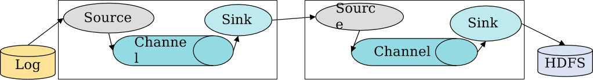

# Flume海量日志聚合

## 概述

- Flume是**流式日志采集工具**，Flume提供**对数据进行简单处理**并且**写到各种数据接受方的能力**，Flume提供从本地文件（spooling directory source）、实时日志（taildir、exec）、REST消息、Thrift、Avro、Syslog、Kafka等**数据源上收集数据**的能力 。
- 提供从固定目录下**采集日志信息到目的地（HDFS、HBase、Kafka）能力**。
- 提供**实时采集日志信息**（taildir）到目的地的能力。
- Flume支持**级联**（多个Flume对接起来），**合并数据的能力**。
  - 
- Flume支持**按照用户定制采集数据**的能力。

- Flume基础架构：Flume可以**单节点直接采集数据**，主要**应用于集群内数据**。
- Flume多Agent架构：Flume可以将**多个节点连接起来**，**将最初的数据源经过收集，存储到最终的存储系统中**。主要**应用于集群外的数据导入到集群内**。 

## Flume架构

- Source:数据源，即是产生**日志信息的源头**，**Flume会将原始数据建模抽象成自己处理的数据对象**：event。

  - Source负责接收events或通过特殊机制产生events，并将events**批量放到一个或多个Channels**。

  - 有驱动和轮询2种类型的Source。

    - **驱动**型Source:是外部主动发送数据给Flume，驱动Flume接受数据。
    - **轮询**Source:是Flume周期性主动去获取数据。

  -  Source**必须至少**和一个Channel关联。

  - | **Source** **类型**       | **说明**                                                     |
    | ------------------------- | ------------------------------------------------------------ |
    | exec source               | 执行某个命令或者脚本，并将其执行结果的输出作为数据源。       |
    | avro source               | 提供一个基于avro协议的server，bind到某个端口上，等待avro协议客户端发过来的数据。 |
    | thrift source             | 同avro，不过传输协议为thrift。                               |
    | http source               | 支持http的post发送数据。                                     |
    | syslog source             | 采集系统syslog。                                             |
    | spooling directory source | 采集本地静态文件。                                           |
    | jms source                | 从消息队列获取数据。                                         |
    | Kafka source              | 从Kafka中获取数据。                                          |

- Channel Pocessor:通道处理器，主要作用是将**source发过来的数据放入通道（channel）中**。

- Interceptor：拦截器，主要作用是**将采集到的数据根据用户的配置进行过滤、修饰**。

- Channel Selector：通道选择器 ，主要作用是**根据用户配置将数据放到不同的通道channel中**。

- Channel:通道，主要作用是**临时缓存数据**。

  - Channel**位于Source和Sink之间**，Channel的作用类似队列，用于临时缓存进来的events，当Sink成功地将events发送到下一跳的Channel或最终目的，events从Channel移除。
  - Channels**支持事务**，提供较弱的顺序保证，**可以连接任何数量的Source和Sink**。
  - 不同的Channel提供的持久化水平也是不一样的：
    - Memory Channel：不会持久化 。消息存放在内存中，提供高吞吐，但不提供可靠性；可能丢失数据
    - File Channel：基于WAL（预写式日志Write-Ahead Log）实现。对**数据持久化**；但是配置较为麻烦，**需要配置数据目录和checkpoint目录**；**不同的File Channel均需要配置一个checkpoint目录**。
    - JDBC Channel：基于嵌入式Database实现。**内置的derby数据库，对event进行了持久化，提供高可靠性**；可以取代同样具有持久特性的File Channel

- Sink Runner: Sink运行器，主要作用是通过它来**驱动Sink Processor, Sink Processor驱动sink来从channel中取数据**。

  - Sink负责将events传输到下一跳或最终目的，成功完成后将events从Channel移除。

  - Sink必须作用于一个**确切的Channel**。

  - | **Sink类型**       | **说明**                                  |
    | ------------------ | ----------------------------------------- |
    | hdfs sink          | 将数据写到HDFS上。                        |
    | avro sink          | 使用avro协议将数据发送给另下一跳的Flume。 |
    | thrift sink        | 同avro，不过传输协议为thrift。            |
    | file roll sink     | 将数据保存在本地文件系统中。              |
    | hbase sink         | 将数据写到HBase中。                       |
    | Kafka sink         | 将数据写入到Kafka中。                     |
    | MorphlineSolr sink | 将数据写入到Solr中。                      |

## 关键特性

**Flume支持采集日志文件**

- Flume支持将集群内的日志文件**采集并归档**到HDFS、HBase、Kafka上，**供上层应用对数据分析、清洗数据使用**。

**Flume支持多级级联和多路复制**

- Flume支持将多个Flume级联起来，**同时级联节点内部支持数据复制**。

**Flume级联消息压缩、加密**

- Flume级联**节点之间**的**数据传输支持压缩和加密**，**提升数据传输效率和安全性**。
- 非级联，sink到存储介质时，**视存储介质和sink类型是否支持加密**。
- Source到channel到sink等进程内部没有加密的必要，属于**进程内部数据交换**。

**Flume数据监控**

- **Flume Source接受数据量、Channel缓存数据量、Sink写入数据量，通过Manager图形化呈现监控指标**。
- 支持Channel缓存、数据发送、**接收失败告警**。

**Flume传输可靠性**

- Flume在传输数据过程中，采用**事务管理方式**，保证传输过程中数据不会丢失，增强了数据传输的可靠性，**同时缓存在Channel中的数据如果采用File Channel**，进程或者节点重启数据不会丢失。
- **Source至Channel支持事务**，**Channel到sink支持事务**。及事件采集或发送失败，会重新采集或发送。

- Flume在传输数据过程中，如果下一跳的Flume节点故障或者数据接受异常时，可以**自动切换到另外一路上继续传输**。 

**Flume传输过程中数据过滤**

- Flume在传输数据过程中，可以**简单的对数据简单过滤、清洗，可以去掉不关心的数据**，同时如果需要对复杂的数据过滤，需要用户根据自己的数据特殊性，开发过滤插件，**Flume支持第三方过滤插件调用**。
- Inteceptor:过滤器，可以对数据过滤。
- Channel selector:通道选择器，可以根据事件将数据发到不同的channel中，实现数据路由功能。
- Source端配置可增加**正则匹配过滤**。