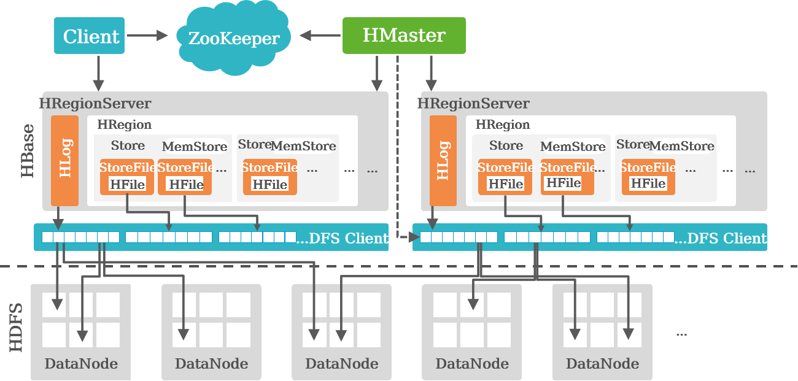
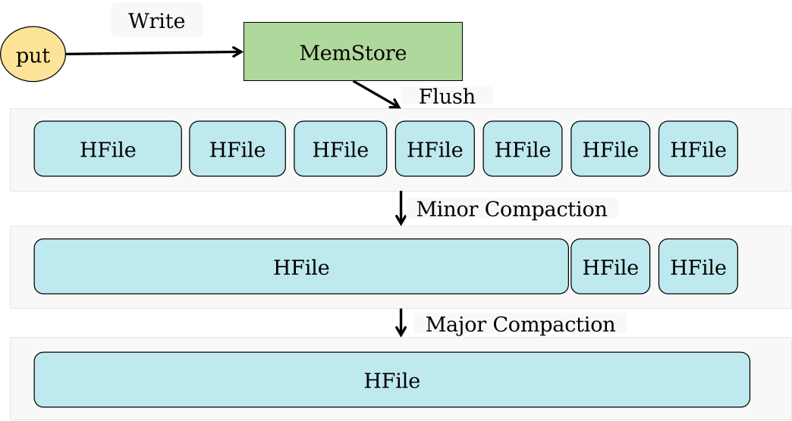

# HBase分布式数据库

## 简介

HBase是一个**高可靠性、高性能、面向列、可伸缩**的分布式存储系统。

HBase ：兼容结构化/非结构化数据，容量大，高并发，低时延，低成本的数据库

- 适合于存储大表数据（表的规模可以达到数十亿行以及数百万列），并且对大表数据的读、写访问可以达到实时级别。
- 利用Hadoop **HDFS**（Hadoop Distributed File System）作为其**文件存储系统**，提供实时读写的分布式数据库系统。
- 利用**ZooKeeper作为协同服务**。

## HBase与关系型数据库的对比

- 数据索引：关系数据库通常可以针对不同列构建复杂的多个索引，以提高数据访问性能。HBase只有一个索引——**行键**，通过巧妙的设计，HBase中的所有访问方法，或者通过行键访问，或者通过行键扫描，从而使得整个系统不会慢下来。
- 数据维护：在关系数据库中，更新操作会用最新的当前值去替换记录中原来的旧值，旧值被覆盖后就不会存在。而在HBase中执行更新操作时，并不会删除数据旧的版本，而是生成一个**新的版本**，**旧有的版本仍然保留**。版本号记录
- 可伸缩性：关系数据库很难实现横向扩展，纵向扩展的空间也比较有限。相反，HBase和BigTable这些分布式数据库就是为了实现灵活的水平扩展而开发的，能够轻易地通过在**集群中增加或者减少硬件数量**来实现性能的伸缩。

## 数据模型

- 应用程序是以表的方式在HBase存储数据的。表是由行和列构成的，所有的列是从属于某一个**列族**的。
- 表结构稀疏，行和列的交叉点称之为单元格（cell），**cell是版本化**的。cell的内容是不可分割的**字节数组**。
- 表的行键也是一段字节数组，所以任何东西都可以保存进去，不论是字符串或者数字。所有的表都**必须要有主键-key**。
- HBase的表是按key排序的，排序方式是针对**字节**的。

> 表：HBase采用表来组织数据，表由行和列组成，列划分为若干个列族。
>
> 行：每个HBase表都由若干行组成，每个行由行键（Row Key）来标识。
>
> 列族：一个HBase表被分组成许多“列族”（Column Family）的集合，它是基本的访问控制单元。
>
> 列限定符：列族里的数据通过列限定符（或列）来定位。
>
> 单元格：在HBase表中，通过行、列族和列限定符确定一个“单元格”（cell），单元格中存储的数据没有数据类型，总被视为字节数组byte[]。
>
> 时间戳：每个单元格都保存着同一份数据的多个版本，这些版本采用时间戳进行索引。

## 行存和列存的比较

- 行存储，数据按行存储在底层文件系统中。通常，每一行会被分配固定的空间。
  - 优点：有利于**增加/修改**整行记录等操作；**有利于整行数据的读取操作**。
  - 缺点：单列查询时，会读取一些不必要的数据。
- 列存储，数据以列为单位，存储在底层文件系统中。
  - 优点：有利于**面向单列数据的读取/统计**等操作。
  - 缺点：整行读取时，可能需要**多次I/O**操作。

## 体系架构

- ZooKeeper为HBase集群中各进程提供分布式协作服务。各RegionServer将自己的信息注册到Zookeeper中，主用Master据此感知各个RegionServer的**健康状态**。
- Client使用HBase的**RPC机制**与Master、RegionServer进行通信。Client与Master进行**管理类**通信，与RegionServer进行**数据操作类**通信。
- RegionServer负责提供**表数据读写等服务**，是HBase的**数据处理和计算单元**。RegionServer一般与HDFS集群的DataNode部署在一起，**实现数据的存储功能**。
- HMaster，在HA模式下，包含主用Master和备用Master。
  - 主用Master：负责HBase中RegionServer的管理，包括**表的增删改查；RegionServer的负载均衡，Region分布调整；Region分裂以及分裂后的Region分配；RegionServer失效后的Region迁移**等。 
  - 备用Master：当主用Master故障时，备用Master将**取代主用Master对外提供服务**。**故障恢复后，原主用Master降为备用**。
- HDFS为HBase提供高可靠的文件存储服务，HBase的数据**全部存储在HDFS**中。
- MemStore：当RegionServer中的MemStore大小达到配置的容量上限时，RegionServer会将MemStore中的数据“flush”到HDFS中。
- StoreFile：随着数据的插入，一个Store会产生多个StoreFile，当StoreFile的个数达到**配置的最大值**时，RegionServer会将多个StoreFile**合并**为一个大的StoreFile。

### 客户端：

- 客户端包含访问HBase的接口，但并**不直接从HMaster主服务器上读取数据**，而是通过Zookeeper获得Region位置信息后，直接从HRegionServer上读取数据。大多数客户端甚至从来不和HMaster通信，这种设计方式使得HMaster负载很小。
  - 客户端是先查询**hbase:meta**表，再确定**Region**的位置，定位到所需要的区域后，客户端会直接去访问相应的Region，发起读写请求。
- 客户端会在**缓存**中维护着**已经访问过**的**Region位置信息**，用来加快后续数据访问过程。

### HRegionServer

- 是HBase中最核心的模块。
  - 负责**存储**和**维护**分配给自己的Region。
  - 处理来自客户端的读写请求。

### Region

HBase表开始只有一个Region，当Region的大小超出了预设的阈值时，HBase会**拆分**Region。

Region拆分操作非常快，接近瞬间，因为拆分之后的Region读取的仍然是原存储文件，**直到分裂过程结束**，把存储文件异步地写到独立的文件之后，才会读取新文件。

Region拆分策略：

- ConstantSizeRegionSplitPolicy
- IncreasingToUpperBoundRegionSplitPolicy
- SteppingSplitPolicyKeyPrefixRegionSplitPolicy
- DelimitedKeyPrefixRegionSplitPolicy
- DisabledRegionSplitPolicy

- Region分为**元数据Region**（Meta Region）以及**用户Region**（User Region）两类。
- Meta Region记录了每一个User Region的路由信息。
- 读写Region数据的路由，包括如下几步：
- - 找寻Meta Region地址。
  - 再由Meta Region找寻User Region地址。
- 为了加快访问速度，hbase:meta表会被保存在内存中。
- 假设hbase:meta表的每行（一个映射条目）在内存中大约占用1 KB，并且每个Region限制为128 MB。
- **两层结构可以保存的Region数目**是128 MB/1 KB = 217个Region。

### 用户读写数据过程

- 用户写入数据时，被分配到相应HRegionServer去执行。
- 用户数据首先被写入到Hlog中，再写入MemStore中，最终写到磁盘上形成StoreFile。
- 只有当操作写入Hlog之后，**commit()**调用才会将其返回给客户端。
- 当用户读取数据时， HRegionServer会首先访问MemStore缓存，如果找不到，再去磁盘上面的StoreFile中寻找。

### 缓存刷新

- 系统会周期性地把MemStore缓存里的内容刷写到磁盘的StoreFile文件中，清空缓存，并在Hlog里面写入一个标记。
- 每次刷写都生成一个新的StoreFile文件，因此，每个Store包含多个StoreFile文件。
- 每个HRegionServer都有一个自己的HLog文件，每次启动都**检查该文件**，确认最近一次执行缓存刷新操作之后是否发生新的写入操作；如果发现更新，则**先写入MemStore，再刷写到StoreFile**，开始为用户提供服务。
- 触发MemStore的Flush操作场景
  - MemStore到达HBase.hregion.memstore.flush.size的指定大小（**默认128 MB**），所有MemStore触发Flush。
  - 当MemStore的内存用量比例到达HBase.regionserver.global.memstore.upp -erLimit的指定大小时，触发Flush。Flush的顺序基于**MemStore内存用量大小**的倒序，直到MemStore内存用量小于HBase.regionserver.global.memstore.lowerLimit 。
  - 当WAL的**日志数量**超过HBase.regionserver.max.logs，MemStore就会Flush到磁盘，降低WAL中的日志数量。 最“老”的MemStore会第一个被Flush，直到日志数量小于HBase.regionserver.max.logs。
  - HBase定期Flush MemStore：**默认周期为1小时**，确保MemStore不会长时间没有持久化。
  - 手动执行Flush。

### HLog工作原理

- 分布式环境必须要考虑系统出错，HBase采用HLog**保证系统恢复**。
- HBase系统为每个HRegionServer配置了一个HLog文件，它是一种**预写式日志**（Write Ahead Log）。
- 用户更新数据**必须首先写入日志**后，才能**写入MemStore缓存**，并且，直到MemStore**缓存内容对应的日志已经写入磁盘**，该缓存内容才能被刷写（Flush）到磁盘。
- Zookeeper会实时监测每个HRegionServer的状态，当某个HRegionServer发生故障时，Zookeeper会通知HMaster。
- **HMaster首先会处理该故障HRegionServer上面遗留的HLog文件**，这个遗留的HLog文件中包含了来自多个Region对象的日志记录。
- 系统会根据每条日志记录所属的Region对象对**HLog数据进行拆分**，分别放到相应Region对象的目录下，然后，再将失效的Region重新分配到可用的HRegionServer中，并把与该Region对象相关的HLog日志记录也发送给相应的HRegionServer。
- HRegionServer领取到分配给自己的Region对象以及与之相关的HLog日志记录以后，会**重新做一遍日志记录中的各种操作**，把日志记录中的数据写入到MemStore缓存中，然后，刷新到磁盘的StoreFile文件中，完成数据恢复。
- 共用日志优点：**提高对表的写操作性能**；缺点：**恢复时需要分拆日志**。

### 性能优化

#### Compaction机制

- HFile文件数目越来越多，读取时延也越来越大。
- Compaction的目的，是为了**减少同一个Region中同一个ColumnFamily下面的小文件**（HFile）数目，从而提升读取的性能。
- **合并前，对HFile进行排查**
  1. 刚copact完的
  2. HFile过大的
- Compaction分为Minor、Major两类：
  - Minor Compaction：小范围的Compaction。有**最少和最大文件数目限制**。通常会**选择一些连续时间范围的小文件进行合并**。
  - Major Compaction：涉及该Region该ColumnFamily下面的**所有**的HFile文件。
    - 用户强制主压缩
    - 长时间没有compact，而且候选文件小于某个值。默认是10
    - store中有临时文件
  - Minor Compaction选取文件时，遵循一定的算法。

#### OpenScanner

在寻找到rowkey所对应的RegionServer和Region之后，需要打开一个查找器Scanner，由其具体执行查找数据，Region中会包含内存数据**MemStore**，文件数据**Hfiles**，那么在open scanner的时候就需要分别读取这两块数据，打开对应不同的scanner做查询操作。

- OpenScanner的过程中，会创建两种不同的Scanner来读取Hfile、MemStore的数据：
  - HFile对应的Scanner为StoreFileScanner。
  - MemStore对应的Scanner为MemStoreScanner。

#### BloomFilter

**不存在： 如果Bloom判断数据不存在，那么数据肯定是不存在的；如果判断结果为数据存在，那么有可能是错误的**

- BloomFilter用来优化一些随机读取的场景，即Get场景。它可以被用来快速的判断一条用户数据在一个大的数据集合（该数据集合的大部分数据都没法被加载到内存中）中是否存在。
- BloomFilter在判断一个数据是否存在时，拥有一定的误判率。但对于“用户数据 XXXX不存在”的判断结果是可信的。
- HBase的BloomFilter的相关数据，被保存在HFile中。

#### 行键(Row Key)

- 行键是按照**字典序**存储，因此，设计行键时，要充分利用这个排序特点，将**经常一起读取的数据存储到一块**，将最近可能会被访问的数据放在一块。
- 举个例子：如果最近写入HBase表中的数据是最可能被访问的，可以考虑将时间戳作为行键的一部分，由于是字典序排序，所以可以使用Long.MAX_VALUE-timestamp作为行键，这样能保证新写入的数据在读取时可以被快速命中。
- HBase只有一个针对行健的索引。
- 访问HBase表中的行，只有三种方式：
  - 通过单个行健访问
  - 通过一个行健的区间来访问
  - 全表扫描

#### Hindex二级索引

Hindex是华为公司开发的**纯Java**编写的HBase二级索引，兼容Apache HBase 0.94.8。当前的特性如下：

- 多个表索引
- 多个列索引
- 基于部分列值的索引