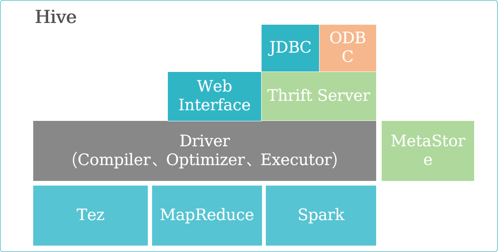
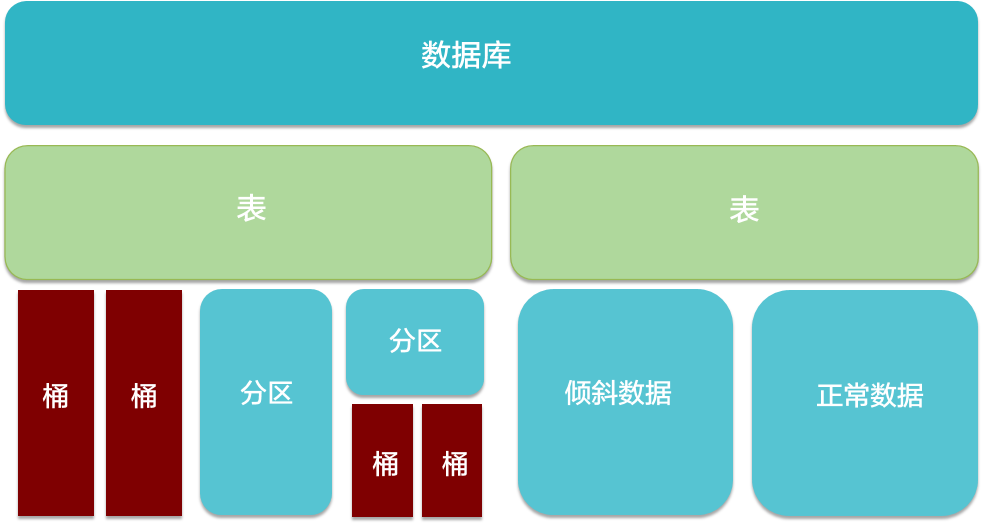

# Hive分布式数据仓库

## 简介

- Hive是基于Hadoop的数据仓库软件，可以查询和管理**PB级别**的分布式数据。
- Hive特性：
  - 灵活方便的ETL（extract/transform/load）。
  - 支持**Tez、Spark**等多种计算引擎。
  - 可直接访问HDFS文件以及HBase。
  - 易用易编程。

## 数据仓库对比

|              | **Hive**                                                     | **传统数据仓库**                                             |
| ------------ | ------------------------------------------------------------ | ------------------------------------------------------------ |
| **存储**     | HDFS，理论上有无限拓展的可能。                               | 集群存储，存在容量上限，而且伴随容量的增长，计算速度急剧下降只能适应于数据量比较小的商业应用，对于超大规模数据无能为力。 |
| **执行引擎** | 默认执行引擎Tez。                                            | 可以选择更加高效的算法来执行查询，也可以进行更多的优化措施来提高速度。 |
| **使用方式** | HQL（类似SQL）                                               | SQL                                                          |
| **灵活性**   | 元数据存储独立于数据存储之外，从而解耦合元数据和数据。       | 低，数据用途单一                                             |
| **分析速度** | 计算依赖于集群规模，易拓展，在大数据量情况下，远远快于普通数据仓库。 | 在数据容量较小时非常快速，数据量较大时，急剧下降。           |
| **索引**     | 效率较低。                                                   | 高效。                                                       |
| **易用性**   | 需要自行开发应用模型，灵活度较高，但是易用性较低。           | 集成一整套成熟的的报表解决方案，可以较为方便的进行数据的分析。 |
| **可靠性**   | 数据存储在HDFS，可靠性高，容错性高。                         | 可靠性较低，一次查询失败需要重新开始。数据容错依赖于硬件Raid。 |
| **依赖环境** | 依赖硬件较低，可适应一般的普通机器。                         | 依赖于高性能的商业服务器。                                   |
| **价格**     | 开源产品。                                                   | 商用比较昂贵。                                               |

## Hive的优点

- 高可靠、高容错
  - 1.HiveServer采 用集群模式 ，对外提供SQL服务的主要进程。
  - 2.双MetaStore HiveServer 。提供**元数据信息的进程**，可供HiveServer，SparkSQL，Oozie等组件调用
  - 3.超时重试机制
- 类SQL
  - 1.类似SQL语法
  - 2.内置大量函数
- 可扩展
  - 1.自定义存储格式
  - 2.自定义函数
- 多接口
  - 1.**Beeline**  hive的远程连接命令行客户端
  - 2.JDBC
  - 3.**Thrift** 一种序列化、通信协议
  - 4.ODBC

## Hive的架构

- MetaStore : 存储表、列和Partition等元数据。
- Driver :  管理HiveQL执行的生命周期，并贯穿Hive任务整个执行期间。
- Compiler : 编译HiveQL并将其转化为一系列相互依赖的Map/Reduce任务。
- Optimizer : 优化器，分为逻辑优化器和物理优化器，分别对HiveQL生成的执行计划和MapReduce任务进行优化。
- Executor : 按照任务的依赖关系分别执行Map/Reduce任务。
- ThriftServer : 提供thrift接口，作为JDBC和ODBC的服务端，并将Hive和其他应用程序集成起来。
- Clients : 包含命令行接口Beeline 和JDBC/ODBC 接口，为用户访问提供接口。
- Hive的语句最终在Tez,MapReduce,Spark上执行

## Hive数据存储模型

- 数据库：创建表时如果不指定数据库，则默认为default数据库。
- 表：物理概念，实际对应HDFS上的一个目录。
- 分区：对应所在表所在目录下的一个子目录。
  - 每个分区是一个目录。
  - 分区数量不固定。
  - 分区下可再有分区或者桶。
- 桶：对应表或分区所在路径的一个文件。
  - 每个桶是一个文件。
  - 建表时指定桶个数，桶内可排序。
  - 数据按照某个字段的值Hash后放入某个桶中。
- 倾斜数据：数据集中于个别字段值的场景，比如按照城市分区时，80%的数据都来自某个大城市。
- 正常数据：不存在倾斜的数据。

**Hive可以创建托管表和外部表：** 托管表删除元数据和数据都会删除，外部表只删除元数据

- 创建Hive表，Hive会将数据移动到数据仓库目录。
- 如果所有处理都由Hive完成，建议使用托管表。
- 如果要用Hive和其它工具来处理同一个数据集，建议使用外部表。