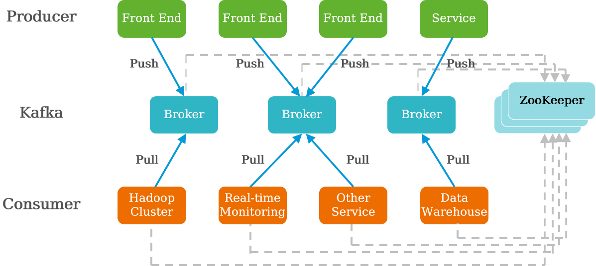
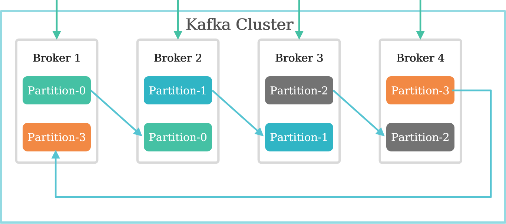
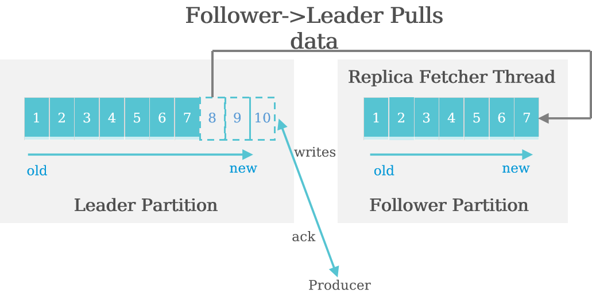

# Kafka分布式消息订阅系统

- Kafka是最初由Linkedin公司开发，是一个**分布式、分区的、多副本的、多订阅者**，**基于Zookeeper协调**的分布式日志系统。
- 要应用场景是：**日志收集系统和消息系统**。
- 分布式消息传递基于**可靠的消息队列**，在客户端应用和消息系统之间**异步传递**消息。有两种主要的消息传递模式：**点对点传递模式、发布-订阅模式**。大部分的消息系统选用发布-订阅模式。Kafka就是一种发布-订阅模式。

**点对点消息传递模式**

在点对点消息系统中，消息持久化到一个队列中。此时，将**有一个或多个消费者消费队列中的数据**。但是**一条消息只能被消费一次**。当一个消费者**消费了队列中的某条数据之后，该条数据则从消息队列中删除**。该模式**即使有多个消费者同时消费数据，也能保证数据处理的顺序**。

**发布-订阅消息传递模式**

在发布-订阅消息系统中，消息被持久化到一个**topic**中。与点对点消息系统不同的是，**消费者可以订阅一个或多个topic，消费者可以消费该topic中所有的数据**，同一条数据可以被**多个消费者消费**，数据被消费后**不会立马删除**。在发布-订阅消息系统中，消息的生产者称为发布者，消费者称为订阅者。

## 特点

- 以时间复杂度为**O(1)**的方式提供消息持久化能力，即使**对TB级以上数据也能保证常数时间的访问性能**。
- 高吞吐率。即使在廉价的商用机器上也能做到单机支持**每秒100K条**消息的传输。
- 支持**消息分区**，及分布式消费，同时保证每个分区内消息**顺序传输**。同时支持**离线数据处理和实时数据**处理。
- Scale out：支持在线水平扩展。

## 架构与功能

- Broker:Kafka集群包含一个或多个服务实例，这些**服务实例**被称为Broker。
- Topic:每条发布到Kafka集群的消息都有一个类别，这个类别被称为Topic。
  - 消费者从左至右顺序读取消息，使用**Offset来记录读取的位置**
- Partition:Kafka将Topic分成一个或者多个Partition，**每个Partition在物理上对应一个文件夹**，该文件夹下存储这个Partition的**所有消息和索引文件**。**有序且不可变的消息队列**
  - 每个topic被分成多个partition(区),**每个partition在存储层面对应一个log文件**，log文件中记录了所有的消息数据。
  - 引入Partition机制，保证了Kafka的高吞吐能力，因为Topic的多个Partition分布在不同的Kafka节点上，这样一来多个客户端（Producer和Consumer）就可以**并发访问不同的节点**对一个Topic进行消息的读写。
- Producer:负责发布消息到Kafka Broker。
- Consumer:消息消费者，从Kafka Broker读取消息的客户端。
- Consumer Group:每个Consumer属于一个特定的Consumer Group(可为每个Consumer指定group name)。
  - 每个Consumer都属于一个Consumer group，每条消息只能被Consumer group中的一个Consumer消费，但可以被多个Consumer group消费。即**组间数据是共享的，组内数据是竞争的**。

**Offset**

- 每条消息在文件中的位置称为**offset（偏移量**），offset是一个long型数字，它唯一标记一条消息。消费者通过**（offset、partition、topic）跟踪记录**。
  - 任何发布到此Partition的消息都会被直接追加到log文件的尾部。
- Consumer在从Broker读取消息后，可以选择commit，该操作会在Kakfa中保存该Consumer在该Partition中读取的消息的offset。该Consumer下一次再读该Partition时会从下一条开始读取。
- 通过这一特性可以保证同一消费者从Kafka中**不会重复消费数据**。
- **消费者group**位移保存在__consumer_offsets的目录上：__
  - 计算公式：Math.abs(groupID.hashCode()) % 50
  - kafka-logs目录，里面有多个目录，因为kafka**默认会生成50个**__consumer_offsets-n目录

## 数据管理

**Kafka Partition Replica**

- 每个Partition又有一至多个Replication，Partition的Replication分布在集群的**不同Broker**上，以提高可用性。从存储角度分析，Partition的每个Replication在逻辑上抽象为一个日志（Log）对象，即**Partition的Replication与日志对象是一一对应的**。

- 副本特性：
  - 副本以分区为单位。每个分区都有各自的主副本和从副本。
  -  主副本叫做Leader，从副本叫做Follower。Follower通过拉取的方式从Leader中同步数据。
  - 消费者和生产者都是从Leader中读写数据，不与Follower交互。

**Kafka主从消息同步**

- Kafka分区副本（Follower）从领导者（Leader）那里**拉取高水位以下**的已经存储的消息到本地的Log（日志）。

**Kafka HA**

- 同一个Partition可能会有多个Replica（对应server.properties配置中的 default.replication.factor=N）。
- 没有Replica的情况下，一旦Broker宕机，其上所有Patition的数据都不可被消费，同时Producer也不能再将数据存于其上的Patition。
- 引入Replication之后，同一个Partition可能会有多个Replica，而这时需要在这些Replica之间选出一个Leader，Producer和Consumer只与这个Leader交互，**其它Replica作为Follower从Leader中复制数据**。

**Leader Failover**

- 当Partition对应的Leader宕机时，需要**从Follower中选举出新Leader**。在选举新Leader时，一个基本原则是，**新的Leader必须拥有旧Leader commit过的所有消息**。
- 由写入流程可知ISR里面的所有Replica都跟上了Leader，**只有ISR里面的成员**才能选为 Leader。
  - kafka**不是完全同步，也不是完全异步**，是一种**ISR**机制：
    - leader会维护一个与其**基本保持同步的Replica列表**，该列表称为ISR(in-sync Replica)，**每个Partition都会有一个ISR，而且是由leader动态维护**
    - 如果一个flower比一个leader**落后太多**，或者**超过一定时间未发起数据复制请求**，则**leader将其重ISR中移除**
    - 当ISR中**所有Replica**都向Leader发送ACK时，**leader才commit**
  - 对于f+1个Replica，Partition可以在**容忍f个Replica失效的情况下保证消息不丢失**。
- 当所有Replica都不工作时，有两种可行的方案：
  - **等待ISR中的任一个Replica活过来，并选它作为Leader**。可保障数据不丢失，**但时间可能相对较长**。
  - 选择**第一个活过来的Replica**（不一定是ISR成员）作为Leader。**无法保障数据不丢失**，但相对不可用时间较短。

**Kafka数据可靠性**

- Kafka所有消息**都会被持久化到硬盘**中，同时Kafka通过对Topic Partition设置Replication来保障数据可靠。 
- **消息传输语义**
  - 最多一次（At Most Once）
    - 消息可能丢失。
    -  消息不会重复发送和处理。
  - 最少一次（At Lease Once）
    - 消息不会丢失。
    - 消息可能会**重复发送和处理**。
  - 仅有一次（Exactly Once）**Kafka还没实现**
    - **消息不会丢失。**
    - **消息仅被处理一次。** 
- 可靠性保证-幂等性 **最多一次**
  - 一个幂等性的操作就是**一种被执行多次造成的影响和只执行一次造成的影响一样**
    - 每发送到Kafka的消息都将包含一个**序列号**，Broker将使用这个序列号来**删除重复数据**。
    - 这个序列号被持久化到副本日志，所以，即使分区的Leader挂了，**其他的Broker接管了Leader**，新Leader仍可以判断重新发送的是否重复了。
    - 这种机制的**开销非常低**：每批消息只有几个额外的字段。
- 可靠性保证–acks机制
  - Producer需要Server接收到数据之后**发出的确认接收的信号**，此项配置就是指Procuder需要多少个这样的确认信号。此配置实际上代表了数据备份的可用性。以下设置为常用选项：
    - acks=0：设置为0**表示Producer不需要等待任何确认收到的信息**。副本将**立即加到socket  buffer并认为已经发送**。**没有任何保障**可以保证此种情况下Server已经成功接收数据，同时重试配置不会发生作用（因为客户端不知道是否失败）回馈的offset会总是设置为-1。
    - acks=1：这意味着**至少要等待Leader已经成功将数据写入本地Log**，但是并**没有等待所有Follower是否成功写入**。这种情况下，如果**Follower没有成功备份数据，而此时Leader又挂掉，则消息会丢失**。
    - acks=all：这意味着**Leader需要等待所有备份都成功写入日志**，这种策略会保证只**要有一个备份存活就不会丢失数据**。这是最强的保证。

**旧数据处理方式**

- Kafka把Topic中一个Parition大文件分成多个小文件段，通过多个**小文件段**，就容易定期清除或删除已经消费完文件，减少磁盘占用。
- 对于传统的message queue而言，一般会删除已经被消费的消息，而Kafka集群会保留所有的消息，无论其被消费与否。当然，因为磁盘限制，不可能永久保留所有数据（实际上也没必要），因此Kafka需要处理旧数据。

**Kafka Log Cleanup**

日志的清理方式有两种：**delete和compact**。删除的阈值有两种：**过期的时间和分区内总日志大小**。

| **配置参数**        | **默认值** | **参数解释**                                                 | **取值范围**             |
| ------------------- | ---------- | ------------------------------------------------------------ | ------------------------ |
| log.cleanup.policy  | delete     | 当日志过期时（超过了要保存的时间），采用的清除策略，可以取值为删除或者压缩。 | delete或compact          |
| log.retention.hours | 168        | 日志数据文件保留的最长时间。单位：小时。                     | 1 ~ 2147483647           |
| log.retention.bytes | -1         | 指定每个Partition上的日志数据所能达到的最大字节。默认情况下无限制。单位：字节。 | -1 ~ 9223372036854775807 |

**Kafka Log Compact**

- Compact的清理方式是指**至少保留每个key值最新的value消息**。例如：一条消息包含Key和Value两个内容，Key为K1的有3条消息，其值分别为V1、V3、V4，则采用Compact的清理方式时，只保留最新的那条消息，即值为V4的消息。（**如何判断哪条消息为最新消息，因为消息是顺序存储的，offset大的即为后存入的、最新的消息**）。
- 简单的说：**只保留最新版数据**。

