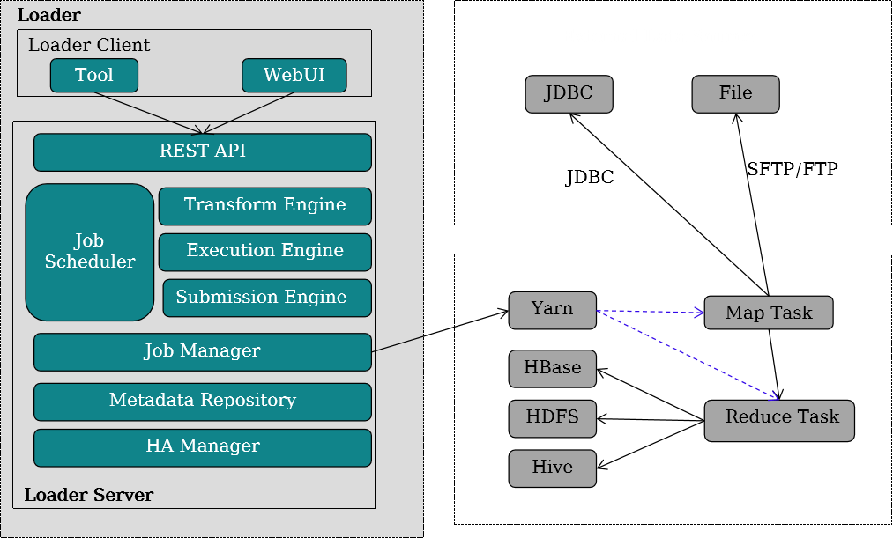

# Loader技术原理

Loader是基于开源Sqoop组件1.99.x版本进行了功能增强，主要用于**大数据平台和结构化数据存储**（例如关系数据库）之间**进行高效的数据导入、导出服务**。

## 概述

- Loader是实现大数据平台与关系型数据库、文件系统之间交换数据和文件的**数据加载工具**。提供**可视化向导式的作业配置管理界面**；**提供定时调度任务**，**周期性执行Loader作业**；在界面中可指定**多种不同的数据源**、**配置数据的清洗和转换步骤**、**配置集群存储系统**等。

**特点**

- 图形化：提供图形化配置、监控界面，操作简便
- 高性能：利用MapReduce并行处理数据
- 高可靠：**Loader Server采用主备双机**；**作业通过MapReduce执行，支持失败重试作业**；**失败后，不会残留数据**
- 安全：Kerberos认证作业权限管理

| **名称**            | **描述**                                                     |
| ------------------- | ------------------------------------------------------------ |
| Loader Client       | Loader的客户端，包括**WebUI和CL**I两种交互界面。             |
| Loader Server       | Loader的服务端，主要功能包括：**处理客户端请求，管理连接器和元数据**，提交MapReduce作业和监控MapReduce作业状态等。 |
| REST API            | 实现RESTful (HTTP+JSON) 接口，处理来自客户端的请求。         |
| Job Scheduler       | 简单的作业调度模块，支持周期性的执行Loader作业。             |
| Transform Engine    | 数据转换处理引擎，支持字段合并、字符串剪切、字符串反序等。   |
| Execution Engine    | Loader作业**执行**引擎，包含MapReduce作业的详细处理逻辑。    |
| Submission Engine   | Loader作业**提交**引擎，支持将作业提交给MapReduce执行。      |
| Job Manager         | **管理Loader作业**，包括创建作业、查询作业、更新作业、删除作业、激活作业、去激活作业、启动作业、停止作业。 |
| Metadata Repository | **元数据仓库**，存储和管理Loader的连接器、转换步骤、作业等数据。 |
| HA Manager          | 管理Loader Server进程的主备状态，Loader Server包含2个节点，以**主备方式**部署。 |

### Loader转换算子

- 长整型时间转换：实现长整型数值与日期类型的互换。
- 空值转换：将空值替换成指定值。
- 增加常量字段：生成常量字段。
- 随机值转换：生成随机数字段。
- 拼接转换：拼接已有字段，生成新字段。
- 分隔转换：将已有字段，按指定分隔符，分隔出新字段。
- 取模转换：对已有字段取模，生成新字段。
- 剪切字符串：通过指定起止位置，截取已有字符串类型的字段，生成新字段。