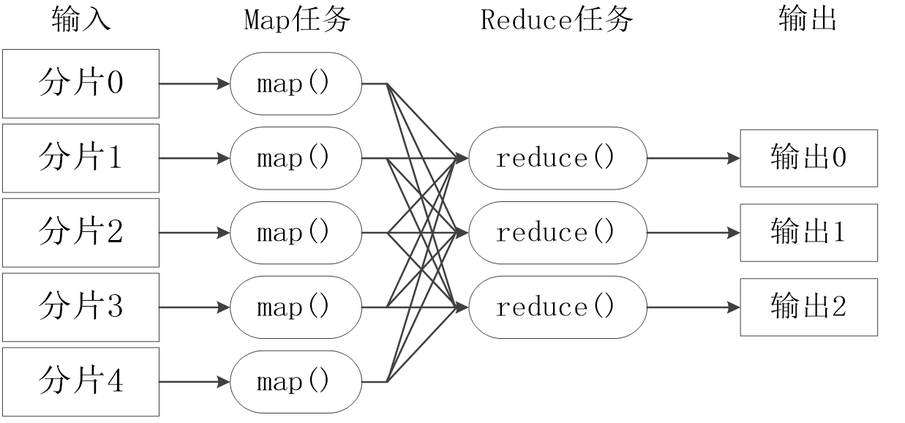

# MapReduce&&Yarn

## MapReduce概述

MapReduce基于**Google发布的MapReduce**论文设计开发，基于**分而治之**的思想，用于大规模数据集（大于1 TB）的**并行计算**和**离线计算**，具有如下特点：

- 高度抽象的编程思想：程序员仅需描述做什么，具体怎么做交由系统的执行框架处理。
- 良好的扩展性：可通过**添加节点以扩展集群能力**。
- 高容错性：通过**计算迁移**或**数据迁移**等策略提高集群的可用性与容错性。

## 资源调度与分配

- 在Hadoop1.0版本中，只有HDFS和MapReduce，而资源调度通过MRv1来进行，存在着很多缺陷：
  - Master是单点，故障恢复**依赖于周期性的Checkpoint**，不保证可靠性，发生故障的时候会通知用户，由用户自行决定是否重新计算。
  - **没有区分作业调度与资源调度**。 MapReduce在运行时，环境会有大量的Job并发，因此多样且高效的调度策略是非常重要的。
  - **没有提到资源隔离与安全性**，大量Job并发的时候，如何保证**单个Job不占用过多的资源**，如何保证用户的程序对系统而言是安全的，在Hadoop 1.0中是个大问题。
- 因此，针对Hadoop1.0中MRv1的不足，以及为了满足编程范式多样化的需求，Hadoop2.0中正式引入了Yarn框架，以便更好地完成集群的资源调度与分配。

## Yarn概述

Apache Hadoop YARN（Yet Another Resource Negotiator），中文名为“另一种资源协调者”。它是一种新的Hadoop资源管理器，它是一个通用资源管理系统，可**为上层应用提供统一的资源管理和调度**，它的引入为**集群在利用率、资源统一管理和数据共享等方面**带来了巨大好处。

## MapReduce过程

- MapReduce计算过程可具体分为两个阶段，Map阶段和Reduce阶段。其中，Map阶段输出的结果是Reduce阶段的输入。
- 可以把MapReduce理解为，把一堆杂乱无章的数据按照某种特征归纳起来，然后处理并得到最后的结果。
  - Map面对的是杂乱无章的互不相关的数据，它解析每个数据，从中提取出key和value，也就是提取了数据的特征。
  - 到了Reduce阶段，数据是以key后面跟着若干个value来组织的，这些value有相关性。在此基础上我们可以做进一步的处理以便得到结果。

- 不同的Map任务之间不会进行通信
- 不同的Reduce任务之间也不会发生任何信息交换
- 用户不能显式地从一台机器向另一台机器发送消息
- 所有的数据交换都是通过MapReduce框架自身去实现的

### Map过程

- Job提交前，先将待处理的文件进行分片（Split）。MR框架默认将一个块（Block）作为一个分片。客户端应用可以重定义块与分片的映射关系。
- Map阶段先把数据放入一个环形内存缓冲区，当缓冲区数据达到**80%**左右时发生溢写 （Spill），需将缓冲区中的数据写入到本地磁盘。
  - 环形缓冲区是一个数组，分左右两端，左边存数据，右边存元数据（左边数据的位置）
- 写入本地磁盘之前通常需要做如下处理：
  - 分区 (Partition)---默认采用**Hash算法**进行分区，MR框架根据**Reduce Task**个数来确定分区个数。具备**相同Key值**的记录最终被**送到相同**的Reduce Task来处理。
  - 排序 (Sort) ---将Map输出的**记录排序**（字典序排序），例如将(‘Hi’,’1’),(‘Hello’,’1’)重新排序为(‘Hello’,’1’), (’Hi’,’1’)。
  - 合并 (Combine) ---这个动作MR框架默认是可选的。例如将 (’Hi’,’1’), (’Hi’,’1’),(‘Hello’,’1’), (Hello’,’1’)进行合并操作为 (’Hi’,list<1,1>), (‘Hello’,list<1,1>)。
  - 归并（Merge）-- 将所有合并后的数据再进行一此合并

### **Reduce阶段**

- 当Reduce Task接收的数据量不大时，则直接存放在内存缓冲区中，随着缓冲区文件的增多，MR后台线程将它们合并成一个更大的有序文件，这个动作是Reduce阶段的Merge操作，过程中会产生许多中间文件，最后一次合并的结果直接输出到用户自定义的Reduce函数。
- 当**数据很少时**，**不需要溢写到磁盘**，**直接在缓存中归并**，然后输出给Reduce。
- 通常在Map Task任务完成MOF输出进度到**3%**时启动Reduce，从各个Map Task获取MOF文件。前面提到**Reduce Task个数由客户端决定**，**Reduce Task个数决定MOF文件分区数**。因此Map Task输出的MOF文件都能找到相对应的Reduce Task来处理。

### Shuffle过程

- Shuffle的定义：Map阶段和Reduce阶段之间**传递中间数据的过程**，包括Reduce Task从**各个Map Task获取MOF文件的过程**，以及对**MOF的排序与合并处理**。
- 每个Map任务分配一个缓存；MapReduce默认100MB缓存；设置溢写比例0.8；排序是默认的操作；排序后可以合并（Combine）。
- 在Map任务全部结束之前进行归并，归并得到一个大的文件，放在本地磁盘。
- 文件归并时，如果溢写文件数量大于预定值（默认是3）则可以再次启动Combiner，少于3不需要。
- JobTracker会一直监测Map任务的执行，并通知Reduce任务来领取数据。
- Reduce任务通过**RPC**向JobTracker询问Map任务是否已经完成，若完成，则领取数据。
- Reduce领取数据先放入缓存，来自不同Map机器，先归并，再合并，写入磁盘。
- 多个溢写文件归并成一个或多个大文件，文件中的键值对是排序的。

## MapReduce On Yarn任务调度流程

- 步骤1：用户向YARN 中提交应用程序， 其中包括ApplicationMaster 程序、启动ApplicationMaster 的命令、用户程序等。
- 步骤2：ResourceManager 为该应用程序分配第一个Container， 并与对应的NodeManager 通信，要求它在这个Container 中启动应用程序的ApplicationMaster 。
- 步骤3：ApplicationMaster 首先向ResourceManager 注册， 这样用户可以直接通过ResourceManage 查看应用程序的运行状态，然后它将为各个任务申请资源，并监控它的运行状态，直到运行结束，即重复步骤4~7。
- 步骤4：ApplicationMaster 采用轮询的方式通过RPC 协议向ResourceManager 申请和领取资源。
- 步骤5：一旦ApplicationMaster 申请到资源后，便与对应的NodeManager 通信，要求它启动任务。
- 步骤6：NodeManager 为任务设置好运行环境（包括环境变量、JAR 包、二进制程序等）后，将任务启动命令写到一个脚本中，并通过运行该脚本启动任务。
- 步骤7：各个任务通过某个RPC 协议向ApplicationMaster 汇报自己的状态和进度，以让ApplicationMaster 随时掌握各个任务的运行状态，从而可以在任务失败时重新启动任务。在应用程序运行过程中，用户可随时通过RPC 向ApplicationMaster 查询应用程序的当前运行状态。
- 步骤8：应用程序运行完成后，ApplicationMaster 向ResourceManager 注销并关闭自己。

## YARN的三种资源调度器

- 在Yarn中，负责给应用分配资源的叫做Scheduler（调度器）。在YARN中，根据不同的策略，共有三种调度器可供选择：
  - FIFO Scheduler：把应用按提交的顺序排成一个队列，这是一个**先进先出队列**，在进行资源分配的时候，先给**队列中最头上的应用进行分配资源**，待最头上的应用需求满足后再给下一个分配，以此类推。
  - Capacity Scheduler：允许**多个组织共享整个集群**，每个组织可以**获得**集群的**一部分**计算能力。通过为每个组织分配专门的队列，然后再为每个队列分配一定的集群资源，通过设置**多个队列的方式给多个组织提供服务**。除此之外，队列内部又可以垂直划分，这样一个组织内部的多个成员就可以共享这个队列资源了。**在一个队列内部，资源的调度是采用的是FIFO策略**。
  - FairS cheduler：为所有的应用分配**公平**的资源（对公平的定义可以通过参数来设置）。

### 资源分配模型

- 调度器维护一群队列的信息。用户可以向一个或者多个队列提交应用。
- 每次NM心跳的时候，调度器根据一定的规则选择一个队列，再在队列上选择一个应用，尝试在这个**应用上分配资源**。
- 调度器会**优先匹配本地资源的申请请求**，**其次是同机架的**，**最后是任意机器的**。

## 增强特性

### Yarn动态内存管理

- 动态内存管理可用来**优化NodeManager中Containers的内存利用率**。任务在运行过程中可能产生多个Container。
- 当前，当单个节点上的Container**超过Container运行内存大小**时，即使节点总的配置内存利用还很低，NodeManager也会终止这些Containers。这样就会经常**使用户作业失败**。
- 动态内存管理特性在当前是一个改进，**只有当NodeManager中的所有Containers的总内存使用超过了已确定的阈值**，NM总内存阈值的计算方法是yarn.nodemanager.resource.memory-mb*1024*yarn.nodemanager.dynamic.memory.usage.threshold，单位GB，那么那些内存使用过多的Containers才会被终止。
- 举例，假如某些Containers的物理内存利用率超过了配置的内存阈值，但所有Containers的总内存利用率并没有超过设置的NodeManager内存阈值，那么那些内存使用过多的Containers仍可以继续运行。

### Yarn基于标签调度

- 在没有标签调度之前，任务提交到哪个节点上是**无法控制**的，会根据一些算法及条件，集群随机分配到某些节点上。而**标签调度可以指定任务提交到哪些节点上**。
- 比如之前需要消耗高内存的应用提交上来，由于运行在那些节点不可控，任务可能运行在普通性能的机器上。
- Label based scheduling是一种调度策略。该策略的基本思想是：用户可以为每个nodemanager标注一个标签，比如high-memory，high-IO等进行分类，以表明该nodemanager的特性；同时，用户可以为调度器中每个队列标注一个标签，即队列与标签绑定，这样，提交到某个队列中的作业，只会使用标注有对应标签的节点上的资源，即任务实际运行在打有对应标签的节点上。
- 将耗内存消耗型的任务提交到绑定了high-memry的标签的队列上，那么任务就可以运行在高内存机器上。