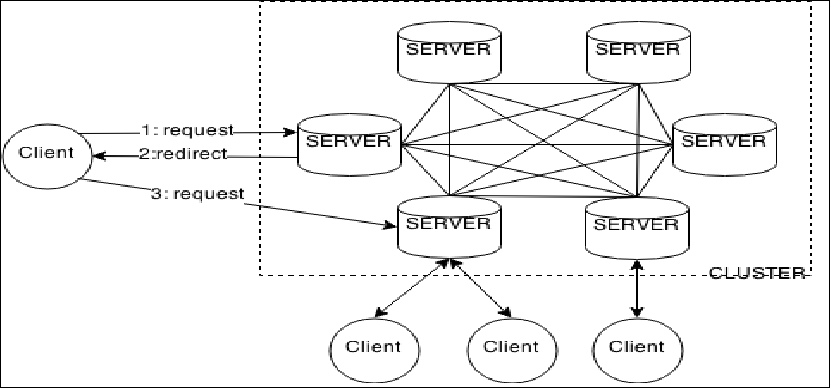
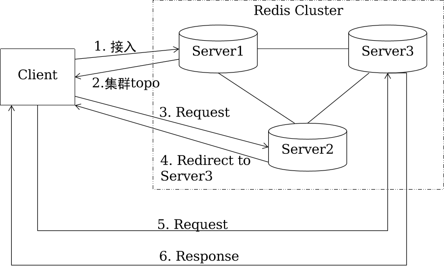

# Redis内存数据库

## 简介

- redis 是用C语言开发的开源的,基于**内存存储的键值对**
- 数据库官方提供测试数据，50个并发执行100000个请求,读的速度是110000次/s,写的速度是81000次/s
- 支持的数据类型：
- - 字符串类型	
  - 散列类型 Map<String,Map<String,String>> map;	
  - 列表类型 list	
  - 集合类型 set	
  - 有序集合类型

- Redis提供了灵活多变的数据结构和数据操作，主要应用于如下场景：
  - 缓存（数据查询、短链接、新闻内容、商品内容等等）
  - 任务队列（秒杀、抢购、12306等）
  - 网站访问统计；
  - 数据过期处理（可以精确到毫秒）
  - 分布式集群架构中的**session分离**

## 架构

- Client可以向**任意节点发起请求**，节点**不会转发请求**，只是**重定向**Client。
- 如果在Client第一次请求和重定向请求之间，**Cluster拓扑发生改变**，则第二次重定向请求将被**再次重定向**，直到找到正确的Server为止。

**读写流程**

1. 客户端选择集群中**任意**一个Server节点进行连接，并发送cluster nodes请求；
2. Server节点返回集群拓扑，主要包括**集群节点列表及槽位跟节点的映射关系**，**客户端在内存中缓存集群拓扑**；
3.  客户端读写数据时，根据**hash(KEY)计算得到KEY归属的槽位**，再查槽位跟节点的映射，进一步得到**KEY归属的节点Server2**，**直接访问该节点进行数据读写**；
4. Server2收到客户端的请求，**检查自身是否为KEY归属的节点**：若不是，则响应中告知Client需重定向的节点Server3；若是，则直接返回业务操作结果；
5.  客户端收到重定向响应，**重新向Server3发起读写请求**；
6. Server3收到请求，处理过程同步骤4。

**Redis的特性--多数据库**

- 每个数据库对外都是以一个**从0开始**的递增数字命名，**不支持自定义的**
- Redis**默认支持16个数据库**，可以通过修改databases参数来修改这个默认值
- Redis默认选择的是**0号数据库**
  - ？：匹配任意一个字符
  - *：匹配0个或者多个任意字符
  - []：匹配括号间的任一字符，可以使用
  - “-”符号表示一个范围。例如a[b-d],可以匹配ab,ac,ad
  - \?：匹配字符?，\是转义字符。
- SELECT 数字： 可以**切换**数据库
- 多个数据库之间**并不是完全隔离**的，**比如flushall命令范围是所有数据库**。
- flushall：**清空Redis实例下所有数据库的数据**
- flushdb：清空**当前**数据库的数据

**Redis中键的生存时间 (expire)**

- Redis中可以使用expire命令设置**一个键的生存时间**，到时间后Redis会**自动删除**它。
  - Expire：设置生存时间（单位/秒）
  - Pexpire：设置生存时间(单位/毫秒)
  - ttl/pttl：查看键的剩余生存时间Persist：取消生存时间
  - expireat [key]：unix时间戳1351858600
  - pexpireat [key]：unix时间戳(毫秒)1351858700000
- 应用场景：
  - 限时的优惠活动信息
  - 网站数据缓存（对于一些需要定时更新的数据，例如：积分排行榜）
  - 限制网站访客访问频率（例如：1分钟最多访问10次）

**Redis持久化 (persistence)**

- Redis支持两种方式的持久化，可以单独使用或者结合起来使用。
  - 第一种：RDB方式（Redis默认的持久化方式）
    - rdb方式的持久化是通过快照完成的，当**符合一定条件时Redis会自动将内存中的所有数据执行快照操作并存储到硬盘上**，默认存储在dump.rdb文件中。
    - redis进行快照的时机（在配置文件redis.conf中）
      - save 900 1：表示900秒内至少一个键被更改则进行快照。
      - save 300 10
      - save 60 10000
    - 手动执行**save或者bgsave命令让redis执行快照**。
      - 两个命令的区别在于，**save是由主进程进行快照操作，会阻塞其它请求**。bgsave是由redis执行**fork函数复制**出一个子进程来进行快照操作。
  - 第二种：AOF方式
    - AOF方式的持久化是通过**日志文件**的方式。**默认情况下Redis没有开启AOF**，可以通过参数appendonly参数开启。
      - appendonly yes
    - Redis写命令同步的时机
      - appendfsync always：每次都会执行;
      - appendfsync everysec：默认 每秒执行一次同步操作（推荐，默认）;
      - appendfsync no：不主动进行同步，由操作系统来做，30秒一次。
    - 动态切换Redis持久方式，**从 RDB 切换到 AOF**（支持Redis 2.2及以上）
      - CONFIG SET appendonly yes
      - CONFIG SET save ""（可选）
    - 注意：当Redis启动时，如果RDB持久化和AOF持久化都打开了，那么程序会**优先使用AOF方式**来恢复数据集，因为**AOF方式所保存的数据通常是最完整的**。如果AOF文件丢失了，则启动之后数据库内容为空。
    - 注意：如果想把正在运行的Redis数据库，**从RDB切换到AOF**，建议**先使用动态切换方式**，再修改配置文件。(不能自己修改配置文件，重启数据库，否则数据库中数据就为空了。)

## 优化

- 精简键名和键值
  - 键名：尽量精简，但是也不能单纯为了节约空间而使用不易理解的键名；
  - 键值：对于键值的数量固定的话可以使用0和1这样的数字来表示，（例如：male/female、right/wrong）。
- 当业务场景不需要数据持久化时，关闭所有的持久化方式可以获得最佳的性能。
- 内部编码优化（了解）
  - Redis为每种数据类型都提供了两种内部编码方式，在不同的情况下Redis会自动调整合适的编码方式。
- SLOWLOG [get/reset/len]
  - slowlog-log-slower-than 它决定要对执行时间大于多少微秒(microsecond，1秒 = 1,000,000 微秒)的命令进行记录;
  - slowlog-max-len 它**决定 slowlog 最多能保存多少条日志**。

- 修改linux内核内存分配策略
  - 向/etc/sysctl.conf添加vm.overcommit_memory = 1,然后重启服务器
  - 或者执行sysctl vm.overcommit_memory=1(立即生效)

- 关闭Transparent Huge Pages(THP)
  - **THP会造成内存锁影响Redis性能，建议关闭** 
    - Transparent HugePages ：用来提高内存管理的性能
    - Transparent Huge Pages在32位的RHEL 6中是不支持的使
  - 用root用户执行下面命令
    - echo never > /sys/kernel/mm/transparent_hugepage/enabled
    - 把这条命令添加到这个文件中/etc/rc.local

- 修改linux中tcp最大连接数
  - 此参数确定了TCP连接中已完成队列(完成三次握手之后)的长度， 当然此值必须不大于Linux系统定义的/proc/sys/net/core/somaxconn值，**Redis默认是511**，而**Linux的默认参数值是128**。当系统并发量大并且客户端速度缓慢的时候，可以将这二个参数一起参考设定。
  - echo 511 > /proc/sys/net/core/somaxconn。
  - 注意：这个参数并不是限制Redis的最大连接数。如果想限制Redis的最大连接数，需要修改maxclients参数，**默认的最大连接数是10000**。

