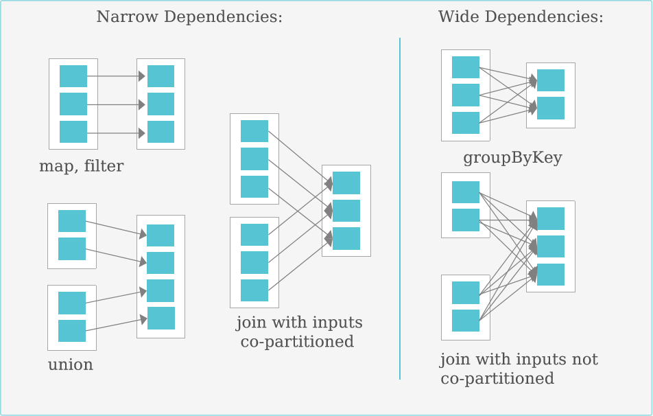
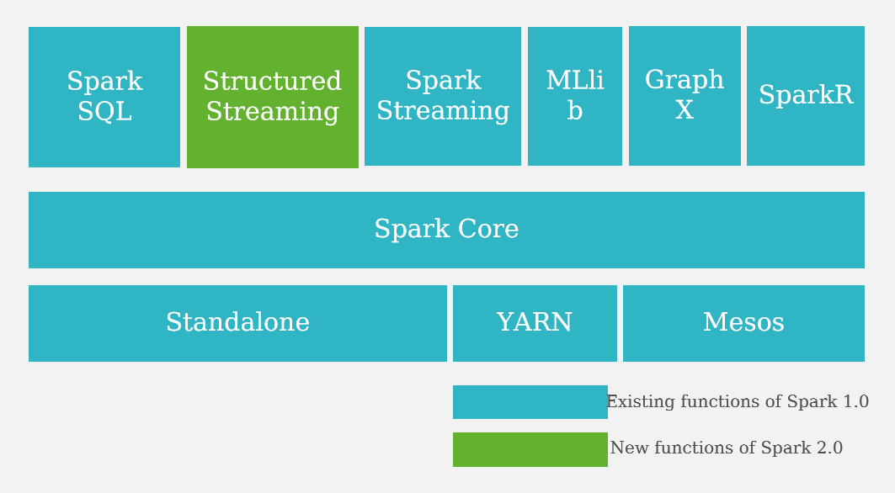

# Spark基于内存的分布式计算

Apache Spark是一种**基于内存**的快速、通用、可扩展的大数据计算引擎。

Spark是一站式解决方案，集批处理、**实时流处理**、交互式查询、图计算与机器学习于一体。

Spark的特点：**轻快灵巧**

- 轻：Spark核心代码只有3万行，使用scala编写
- 快：Spark对小数据集可达到亚秒级的延迟
- 灵：Spark提供了不同层面的灵活性
- 巧：巧妙借力现有大数据组件

## Spark VS MapReduce

|                              | **Hadoop**  | **Spark**   | **Spark**   |
| ---------------------------- | ----------- | ----------- | ----------- |
| 数据大小                     | 102.5 TB    | 102 TB      | 1000 TB     |
| 耗时                         | 72分钟      | 23分钟      | 234分钟     |
| 节点数                       | 2100        | 206         | 190         |
| Cores                        | 50400       | 6592        | 6080        |
| Rate                         | 1.4 TB/min  | 4.27 TB/min | 4.27 TB/min |
| Rate/node                    | 0.67 GB/min | 20.7 GB/min | 22.5 GB/min |
| Daytona Gray类别排序基准规则 | 是          | 是          | 是          |

Spark用十分之一的资源，获得3倍与Mapreduce的性能

## Spark数据结构

### RDD

- RDD（Resilient Distributed Datasets）即弹性分布式数据集，是一个只读的，可分区的分布式数据集。
- RDD默认存储在内存，当内存不足时，溢写到磁盘。
- RDD数据以分区的形式在集群中存储。
- RDD具有血统机制（Lineage），发生数据丢失时，可快速进行数据恢复。

- RDD的生成：从Hadoop文件系统（或与Hadoop兼容的其它存储系统）输入创建（如HDFS）；从父RDD转换得到新的RDD。
- RDD的存储：用户可以选择不同的存储级别存储RDD以便重用（11种）；RDD默认存储于内存，但当内存不足时，RDD会溢出到磁盘中。
- RDD的分区：为减少网络传输代价，和进行分布式计算，需对RDD进行分区。在需要进行分区时会根据每条记录Key进行分区，以此保证两个数据集能高效进行Join操作。RDD的优点：
- RDD是只读的，静态的。因此可提供更高的容错能力；可以实现推测式执行。

**窄依赖**

- 每一个父RDD的Partition**最多被子RDD的一个P**artition使用。如map、filter、union。
- 故障时只要重算和子RDD分区对应的父RDD分区即可
- 传输：每个父RDD的分区只会传入到一个子RDD分区中，通常可以在一个节点内完成转换。

**宽依赖**

- 多个子RDD**的Partition会依赖**同一个父**RDD的Partition。如groupByKey、reduceByKey、sortByKey。
- 极端情况下，所有的父RDD分区都要进行重新计算
- 传输：往往对应着Shuffle操作，需要在运行过程中将同一个父RDD的分区传入到不同的子RDD分区中，中间可能涉及多个节点之间的数据传输

**操作类型**

Spark中的操作大致可以分为创建操作、转换操作、控制操作和行为操作。

- 创建操作（Creation Operation）：用于RDD创建工作。 RDD创建只有两种方法， 一种是来自于**内存集合和外部存储**系统， 另一种是通过**转换操作生成**的RDD。
- 转换操作（Transformation Operation）：将RDD通过一定的操作转变成新的RDD，RDD的转换操作是**惰性操作**，它只是定义了一个新的RDD，并没有立即执行。
  - 惰性操作：只记录，但不操作
- 控制操作（Control Operation）：进行**RDD持久化**， 可以让RDD按不同的存储策略保存在磁盘或者内存中， 比如cache接口默认将RDD缓存在内存中。
- 行动操作（Action Operation）：能够触发Spark运行的操作。Spark中行动操作分为两类，**一类操作输出计算结果**， 另一类将RDD**保存到外部文件系统或者数据库中**。

**DataFrame与DataSet的区别**

- DataFrame
  - DataFrame每一行的类型固定为Row，只有通过解析才能获取各个字段的值，每一列的值没法直接访问。
  - DataFrame编译器缺少类型安全检查。
- DataSet
  - 每一行是什么类型是不一定的，可以是Person，也可以是Row。
  - DataSet类型安全。

**RDD与DataFrame/DataSet的区别**

- RDD
  - 用于Spark1.X各模块的API
  - 不支持SparkSQL操作
  - 不支持代码自动优化

- DataFrame与DataSet
  - 用于Spark2.X各模块的API
  - 支持SparkSQL操作，还能注册临时表，进行sql语句操作
  - 支持一些方便的保存方式，比如保存成csv、json等格式
  - 基于SparkSql引擎构建，支持代码自动优化

## Spark体系架构

- SparkCore：类似于MR的分布式内存计算框架，最大的特点是将中间计算结果直接放在内存中，提升计算性能。自带了Standalone模式的资源管理框架，同时，也支持YARN、MESOS的资源管理系统。FI集成的是Spark On Yarn的模式。其它模式暂不支持。
- SparkSQL：Spark SQL是一个用于处理结构化数据的Spark组件。
  - 通过Spark SQL，可以针对不同数据格式（如：JSON，Parquet， ORC等）和数据源执行ETL操作（如：HDFS、数据库等），完成特定的查询操作。
  - Spark中用于**结构化数据处理**的模块。在Spark应用中，可以**无缝的使用SQL语句亦或是DataFrame API**对结构化数据进行查询。
  - 与Hive对比
    - Spark SQL的执行引擎为**Spark Core**，Hive默认执行引擎为**MapReduce**。
    - Spark SQL的执行速度是Hive的**10-100**倍。
    - Spark SQL**不支持**buckets，Hive支持。
    - Spark SQL依赖**Hive的元数据**。
    - Spark SQL**兼容**绝大部分Hive的语法和函数。
    - Spark SQL可以使用Hive的**自定义函数**。
- SparkStreaming：微批处理的**流处理引擎**，将流数据分片以后用SparkCore的计算引擎中进行处理。相对于Storm，实时性稍差，优势体现在吞吐量上。
  - 将实时输入数据流以时间片（秒级）为单位进行拆分，然后经Spark引擎以类似批处理的方式处理每个时间片数据。
- Mllib和GraphX主要一些算法库。
- Structured Streaming为2.0版本之后的spark独有。
  - Structured Streaming的核心是将流式的数据**看成一张数据不断增加的数据库表**，这种流式的数据处理模型类似于数据块处理模型，可以把静态数据库表的一些查询操作应用在流式计算中，Spark执行标准的SQL查询，从无边界表中获取数据。
  - 无边界表：新数据不断到来，旧数据不断丢弃，实际上是一个连续不断的结构化数据流。

**Spark Streaming vs Storm**

| **对比点**     | **Storm**                        | **Spark Streaming**                                     |
| -------------- | -------------------------------- | ------------------------------------------------------- |
| 实时计算模型   | 纯实时，来一条数据，处理一条数据 | 准实时，对一个时间段内的数据收集起来，作为一个RDD再处理 |
| 实时计算延迟度 | 毫秒级                           | 秒级                                                    |
| 吞吐量         | 低                               | 高                                                      |
| 事务机制       | 支持完善                         | 支持，但不够完善                                        |
| 容错性         | ZooKeeper，Acker，非常强         | Chechpoint，WAL，一般                                   |
| 动态调整并行度 | 支持                             | 不支持                                                  |

事实上，Spark Streaming绝对谈不上比Storm优秀。这两个框架在实时计算领域中，都很优秀，只是擅长的细分场景并不相同。Spark Streaming仅仅在吞吐量上比Storm要优秀。

**对于Storm来说：**

- 建议在那种需要**纯实时**，**不能忍受1秒以上延迟的场景下使用**，比如实时金融系统，要求纯实时进行金融交易和分析。
- 如果对于实时计算的功能中，**要求可靠的事务机制和可靠性机制**，即数据的处理完全精准，一条也不能多，一条也不能少，也可以考虑使用Storm。
- 如果还需要**针对高峰低峰时间段**，**动态调整实时计算程序的并行度**，以最大限度利用集群资源（通常是在小型公司，集群资源紧张的情况），也可以考虑用Storm。
- 如果一个大数据应用系统，它就是纯粹的实时计算，**不需要在中间执行SQL交互式查询、复杂的transformation算子**等，那么用Storm是比较好的选择。

**对于Spark Streaming来说：**

- 如果对上述适用于Storm的三点，一条都不满足的实时场景，即，**不要求纯实时，不要求强大可靠的事务机制，不要求动态调整并行度**，那么可以考虑使用Spark Streaming。
- 位于Spark生态技术栈中，因此**Spark Streaming可以和Spark Core、Spark SQL无缝整合**，也就意味着，我们可以对实时处理出来的中间数据，**立即在程序中无缝进行延迟批处理、交互式查询等操作**。这个特点大大增强了Spark Streaming的优势和功能。

