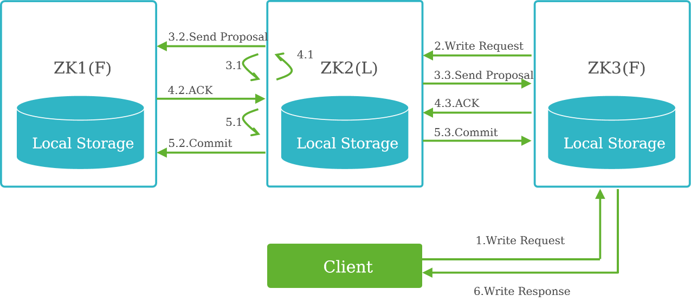

# Zoopeeker

##  概述

- ZooKeeper分布式服务框架主要是用来解决分布式应用中经常遇到的一些数据管理问题，提供分布式、高可用性的协调服务能力。 **同步、命名、配置**
- ZooKeeper作为底层组件广泛被上层组件使用并依赖，如Kafka、HDFS、HBase、Storm等，提供配置管理、名字服务、**分布式锁**（防止出现死锁）、集群管理等功能。
- ZooKeeper封装了复杂、易出错的关键服务，将简单易用的接口和性能高效、功能稳定的系统提供给用户。
- 安全模式下ZooKeeper依赖于**Kerberos**和**LdapServer**进行安全认证，非安全模式则不依赖于Kerberos与LdapServer。

## 体系架构

- ZooKeeper集群由一组Server节点组成，这一组Server节点中只存在一个Leader的节点，其他节点都为Follower。
- 启动时选举出Leader。
  - 使用坐标进行选举（机器编号，事务编号）先比事务，在比机器
  - 要获得一半以上
- ZooKeeper使用自定义的**原子消息协议**，保证了整个系统中的节点数据的一致性。
- Leader节点在接收到数据变更请求后，先写磁盘再写内存。
  - 首先将变更写入本地磁盘，以作**恢复之用**。当**所有**的写请求持久化到磁盘以后，才会将变更应用到内存中

## 容灾能力

- ZooKeeper能够完成选举即能够正常对外提供服务。
  - ZooKeeper选举时，当某一个实例获得了半数以上的票数时，则变为leader。
- 对于n个实例的服务，n可能为奇数或偶数。
  - n为奇数时，假定`n=2x+1`，则成为leader的节点需获得x+1票，容灾能力为x。
  - n为偶数时，假定`n=2x+2`，则成为leader的节点需要获得x+2票（大于一半），容灾能力为x。

## 关键特性

- 最终**一致性**：无论哪个Server，对外展示的均是**同一个视图**。
- 实时性：保证客户端将在一个时间间隔范围内获得服务器的更新信息，或者服务器失效的信息。
- 可靠性：一条消息被一个Server接收，它将被所有Server接受。
- 等待无关性：慢的或者失效的Client不会干预快速的Client的请求，使得每个Client都能有效的等待。
- 原子性：更新只能成功或者失败，没有中间状态。
- 顺序一致性：客户端所发送的更新会按照它们被发送的顺序进行应用。

## 读操作

由ZooKeeper的一致性可知，客户端无论连接哪个Server，获取的均是同一个视图。所以，读操作可以在客户端与任意节点间完成。

## 写操作

1. 同读请求一样，客户端可以向任一server提出写请求。
2. server将这一请求发送给leader。
3. leader获取写请求后，会向所有节点发送这条写请求信息，询问是否能够执行这次写操作。
4. follower节点根据自身情况给出反馈信息ACK应答消息，leader根据反馈信息，若获取到的可以执行写操作的**数量大于实例总数的一半**，则认为本次写操作可执行。
5. leader将结果反馈给各follower，并完成写操作，各follower节点同步leader的数据，本次写操作完成。