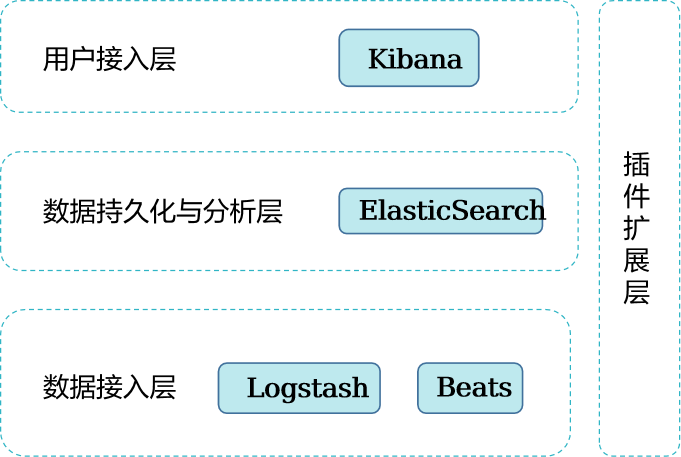
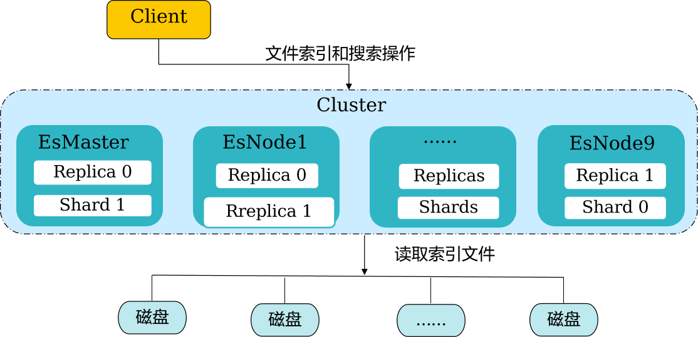
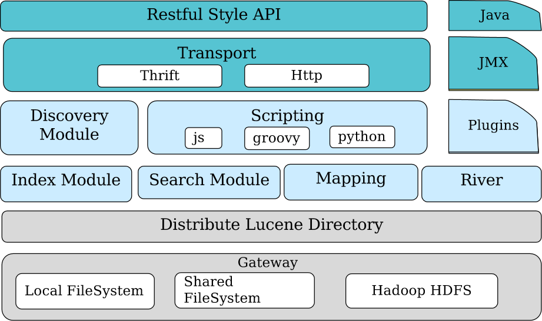

# 分布式搜索服务ElasticSearch

## 简介

- ElasticSearch是一个高性能，基于**Lucene**的**全文检索服务**，是一个分布式的**Restful风格**的搜索和数据分析引擎，也**可以作为NoSQL数据库使用**。
  - 对Lucene进行了扩展
  - 原型环境（实验环境）和生产环境可无缝切换
  - 能够水平扩展
  - 支持结构化和非结构化数据

- **高性能/速度**
  - 能立即获得搜索结果。我们通过有限状态转换器实现了用于全文检索的**倒排索引**，实现了用于存储数值数据和地理位置数据的 **BKD 树**，以及用于**分析的列存储**。由于每个数据都被编入了索引，就不必担心某些数据没有索引。
- **可扩展性**
  - 可以在笔记本电脑上运行。也可在承载了 PB 级数据的成百上千台服务器上运行。
  - 原型环境和生产环境可无缝切换；无论是在一个节点上运行，还是在一个包含 300 个节点的集群上运行，您都能够以相同的方式与 Elasticsearch 进行通信。
  - 能够水平扩展，每秒钟可处理海量事件，同时能够自动管理索引和查询在集群中的分布方式，以实现极其流畅的操作。
- **相关度**
  - 搜索所有内容。找到所需的具体信息。基于各项元素（**从词频或近因到热门度等**）对搜索结果**进行排序**。将这些内容与功能进行混合和匹配，以对向用户显示结果的方式进行微调。Elasticsearch 功能齐全，可以处理包括各种复杂情况（例如拼写错误）在内的人为错误。
- **可靠性  /弹性**
  - Elasticsearch 为您检测这些故障（硬件故障，网络分割）并确保您的集群（和数据）的安全性和可用性。**跨集群复制功能，辅助集群可作为热备份随时投入使用**。Elasticsearch 运行在一个分布式的环境中，从设计之初就考虑到了这一点，目的就是让您永远高枕无忧。

- Logstash：具备**实时数据传输能力的管道**，**着重日志相关处理**；负责将数据信息从管道的输入端传输到管道的输出端；支持灵活根据自己的需求在中间加上滤网，Logstash提供里很多功能强大的滤网以满足你的各种应用场景
- Kibana；**开源的分析和可视化平台**，数据主要由es提供；基于es的搜索与分析能力，拿到用于上层分析和可视化需要的结果；开发者或运维人员可以轻松地执行高级数据分析，并在**各种图表、表格和地图中可视化数据**。
- Beats：专门用于**发送数据的平台**，可以将数据无缝传输给logstash或是es；轻量级代理机制安装，类似于hadoop集群安装时候的ambari或cdh manager；可将数以百千计算机中的数据发送到logstash或是es中。
- es-hadoop：一个深度集成Hadoop和es的项目，是es官方维护的一个子项目；可以达到hadoop与es之间的输入与输出；重点是充分利用Map-Reduce的并行计算优势，为hdfs数据提供实时搜索能力。
- es-sql：用sql来操作es，来代替之前需要写各种复杂的json查询才可解决的问题；es-sql目前有两个版本，第一，是多年前即开始的国内主推开源的nlpchina/es-sql插件，第二，是自2018.06官方es6.3.0发布后正式支持的es-sql功能。
- elasticsearch-head：将是一款专门针对于elasticsearch的客户端工具,是一个界面化的集群操作和管理工具,可以对集群进行傻瓜式操作,是一个基于node.js的前端工程，
- Bigdesk：是elasticsearch的一个集群监控工具，可以通过它来查看es集群的各种状态，如：cpu、内存使用情况，索引数据、搜索情况，http连接数等。

### 应用场景

- 用于日志搜索和分析、时空检索、时序检索、智能搜索等场景。
  - 检索的数据类型复杂：如需要查询的数据有结构化数据、半结构化数据、非结构化数据等，ElasticSearch可以对以上数据类型进行**清洗、分词、建立倒排索引等一系列操作**，然后**提供全文检索的能力**。
  - 检索条件多样化：全文检索条件可以**包括词或短语**。
  - 边写边读：写入的数据可以**实时的进行检索**。

## 系统架构

Cluster：代表一个集群，集群中有多个节点，其中有一个为主节点，这个主节点是可以通过选举产生的，**主从节点是对于集群内部来说的**。

EsNode：**ElasticSearch节点**，一个节点就是一个ElasticSearch实例。	

EsMaster：主节点，**可以临时管理集群级别的一些变更**，例如新建或删除索引、增加或移除节点等。**主节点不参与文档级别的变更或搜索**，**在流量增长时，该主节在流量增长时，该主节点不会成为集群的瓶颈**。	

shards：代表索引分片，**ElasticSearch可以把一个完整的索引分成多个分片**，这样的好处是**可以把一个大的索引拆分成多个，分布到不同的节点上**。

replicas：代表**索引副本**，ElasticSearch可以设置多个索引的副本，副本的作用一是**提高系统的容错性**，当某个节点某个分片损坏或丢失时可以从副本中恢复。二是提高Elasticsearch的查询效率，Elasticsearch会**自动对搜索请求进行负载均衡**。	

高性能：虚拟内存设计；磁盘缓存相关参数；swap调优；replica数目；refresh时间间隔；merge相关参数；mapping设置；定期清理cache多租户：支持多租户；ES实例数根据服务器内存设置，ES单节点实例数 = ES的可用的内存 / 64GB；服务器逻辑磁盘数要跟ES实例数一致，因此ES服务器需要按照实例数做Raid，例如推荐配置256G内存，24块磁盘，那么ES实例数 = 4，需要做4组Raid，每组6块磁盘

ZooKeeper：它在Elasticsearch是必须的，**提供安全认证信息的存储等功能**。

- 接口：通过java ，restful api 提供丰富接口，底层基于lucence，通过本地文件，共享文件，hdfs完成索引存储JMX（Java Management Extensions，即Java管理扩展）是一个为应用程序、设备、系统等植入管理功能的框架。
- JMX（java管理扩展）可以**跨越一系列异构操作系统平台、系统体系结构和网络传输协议，灵活的开发无缝集成的系统、网络和服务管理应用。**
- Recovery：**代表数据恢复或叫数据重新分布**，ElasticSearch在有节点**加入或退出时会根据机器的负载对索引分片进行重新分配**，挂掉的节点重新启动时也会进行数据恢复。
- Lucence Directory:  是lucene的框架服务发现以及选主 ZenDiscovery: 用来实现节点自动发现，还有Master节点选取，假如Master出现故障，其它的这个节点会自动选举，产生一个新的Master
- Plugins：插件**可以通过自定的方式扩展加强Elasticsearch的基本功能**，比如可以自定义类型映射，分词器，本地脚本，自动发现等
- Scripting:使用脚本语言可以计算自定义表达式的值，比如计算自定义查询相关度评分。**支持的脚本语言**有groovy，js，mvel（1.3.0废弃），python等
- Discovery:该模块主要负责集群中**节点的自动发现和Master节点的选举**。节点之间使用**p2p的方式**进行直接通信，不存在单点故障的问题。Elasticsearch中，Master节点维护集群的全局状态，比如节点加入和离开时进行shard的重新分配
- River:代表es的一个**数据源**，也是其它存储方式（如：数据库,官方的river有couchDB的，RabbitMQ的，Twitter的，Wikipedia等）同步数据到es的一个方法。它是以插件方式存在的一个es服务，通过读取river中的数据并把它索引到es中。	
- transport: 代表Elasticsearch**内部节点或集群与客户端的交互方式**，默认内部是**使用tcp协议进行交互**，同时它**支持http协议**（json格式）、**thrift、servlet、memcached、zeroMQ**等的传输协议（通过插件方式集成）。
- gateway: 代表Elasticsearch**索引快照的存储方式**，Elasticsearch默认是先把索引**存放到内存中，当内存满了时再持久化到本地硬盘**。gateway对索引快照进行存储，当这个Elasticsearch集群**关闭再重新启动时就会从gateway中读取索引备份数据**。Elasticsearch支持多种类型的gateway，有**本地文件系统（默认），分布式文件系统，Hadoop的HDFS和amazon的s3云存储服务**。

## 关键特性

### 缓存机制

- ElasticSearch缓存主要分三种：Node Query Cache、Field data Cache、Shard Request Cache。
  - Node Query Cache：属于Node级别的缓存，是对一个**查询中包含的过滤器执行结果进行缓存**。
  - Field data Cache：Fielddata是**专门针对分词的字段在查询期间的数据结构的缓存**。
  - Shard Request Cache：Shard级别的缓存，是为**了缓存“分片级”的本地结果集**。

### ElasticSearch倒排索引

- 正排索引：是**通过Key寻找Value**，即从关键点出发，然后再通过关键点找到信息中满足搜索条件的特定信息。
- 倒排索引：ElasticSearch所采用得排序方式，是**通过Value找Key**。而在全文搜索中Value就是要搜索的关键词，通过Value找到对应的文档。
  - 通过倒排索引进行搜索，就是通过关键词查询对应的文档编号，再通过文档编号找文档，类似于查字典，或通过查书目录查指定页码书的内容。

### ElasticSearch访问接口

- ElasticSearch可通过**RESTful请求**来对数据进行操作。请求分5种：**GET、POST、PUT、DELETE、HEAD**，以实现对文档和索引增删改查。

### ElasticSearch路由算法

- 默认路由： shard=hash（routing）%number_of_primary_shards ，这里路由策略扩展**受到shards个数**的限制，**扩容的时候需要成倍扩容（ES6.x）**，并且在创建index的时候要指定**未来允许扩容的规模**。**ES5.x不支持扩容；ES7.x可以自由扩容**。
- 自定义路由：该路由方式，通过指定**routing的方式**，可以**影响文档写入到哪个shard，也可以仅仅检索特定的shard**。

### ElasticSearch平衡算法

- Elasticsearch中**提供了自动平衡**功能
- 适用场景：**扩容、减容、导入数据**场景 
  - weight_index(node, index) = indexBalance * (node.numShards(index) - avgShardsPerNode(index))
  - Weight_node(node, index) = shardBalance * (node.numShards() - avgShardsPerNode)weight(node, index) = 
  - weight_index(node, index) + weight_node(node, index)

### ElasticSearch扩容

- 扩容场景：物理资源消耗过大，即ElasticSearch的服务**节点的CPU、内存占用率过高、磁盘空间不足ElasticSearch单实例的索引数据太大**，索引的数目达到10亿条或是数据大小达到1 TB。
- 扩容方式：增加EsNode实例。增加节点，在新节点增加EsNode实例。
- 扩容后，采用**自动均衡**策略。

### ElasticSearch减容

- 减容场景：
  - 节点需要重新安装操作系统。
  - 集群数据量减少。
  - 退服场景。
- 减容方式：在**CloudSearch Service管理界面**上删除ElasticSearch实例。
- 减容注意事项：
  - **确保要删除的实例上的shard下的replica在其他实例存在。**
  - **确保要删除的实例上的数据已经迁移到其他节点。**

### ElasticSearch索引HBase数据

- Elasticsearch索引HBase数据是**HBase数据写入的同时，在Elasticsearch建立相应的HBase索引数据**。其中索引**id与HBase数据的rowkey对应**，保证每条索引数据与HBase数据的**唯一**，实现HBase数据的全文检索。
- 批量索引：**针对HBase中已有的数据**，通过提交**MR任务**的形式，将HBase中的全部数据读出，然后在Elasticsearch中建立索引。

### ElasticSearch单节点多实例部署

- 在**同一个节点上部署多个Elasticsearch实例**，根据**IP和不同的端口号**来区分不同的Elasticsearch实例。可以**提高单节点CPU、内存和磁盘的利用率，同时提高Elasticsearch的索引和搜索能力**。

### ElasticSearch副本自动跨节点分配策略

- 单节点多实例部署下，多副本时，如果只做到跨实例分配，存在单点故障，增加默认配置cluster.routing.allocation.same_shard.host:true即可。

### HBase全文索引特性

- 通过建立HBase表和ElasticSearch索引的映射关系，支持索引存储ElasticSearch，而原始数据存储HBase。通过**HBase2ES工具离线索引**。

### 加密鉴权特性

- 对于安全集群，支持对ElasticSearch访问的**加密和鉴权**。

