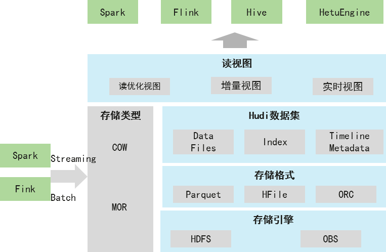
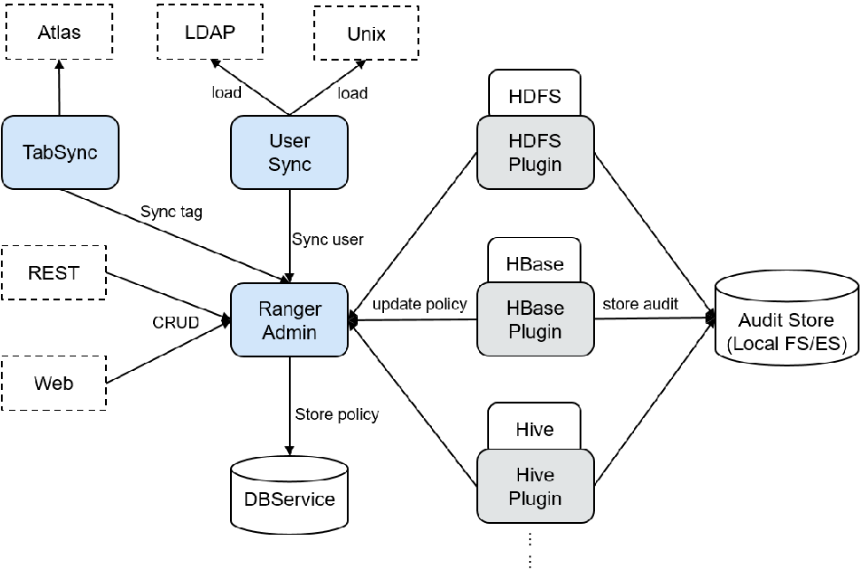

# 华为大数据平台MRS

## 概述

- MRS与自建Hadoop对比优势
  - MRS支持**一键式**创建、删除、扩缩容集群，并通过弹性公网IP便携访问MRS集群管理系统，让大数据集群更加易于使用。
  - MRS支持**自动弹性伸缩**，相对自建Hadoop集群的使用成本更低。
  - MRS支持**存算分离**，大幅提升大数据集群资源利用率。
  - MRS支持**自研CarbonData**和**自研超级调度器Superior Scheduler**，性能更优。
  - MRS基于**鲲鹏处理器进行软硬件垂直优化**，充分释放硬件算力，实现高性价比。
  - MRS支持**多种隔离模式**及企业级的大数据**多租户权限管理能力**，安全性更高。
  - MRS管理节点均实现**HA**，支持完备的可靠性机制，让系统更加可靠。
  - MRS提供统一的**可视化大数据集群管理界面**，让运维人员更加轻松。
  - MRS具有**开放的生态**，支持无缝对接周边服务，快速构建统一大数据平台。

- **云原生架构，快速构建数据湖**
  - 易部署：一键式集群申请，半小时级发放
  - 快速构建：统一入湖；统一元数据管理；统一安全管理
  - 存算分离，架构领先，计算不足扩计算，存储不足扩存储，更好的扩展和部署高阶服务如DataArts Studio、GES等
- **一架三湖，业务场景更丰富**
  - 离线数据湖、实时数据湖、逻辑数据湖
  - 丰富的专题集市：Lakehouse湖内建仓，分析链路短，建设周期快
- **持续演进的企业级版本**
  - 多引擎融合分析，分析提效30%
  - 单集群21K，支持集群联邦
  - 滚动升级，持续演进，业务不中断
  - 容灾：两地三中心高可用

## 组件介绍

### Hudi

- Hudi是Apache在2019年推出的开源项目，在2020年成为Apache顶级项目。
- 华为在2020年参与Hudi相关社区工作，同时FusionInsight产品中对Hudi进行产品化。
- Hudi是一种**数据湖的存储格式**，在Hadoop文件系统之上提供了**更新数据和删除数据的能力以及消费变化数据的能力**。支持多种**计算引擎，提供IUD接口**，在 HDFS的数据集上提供了插入更新和增量拉取的流原语。
- Hudi是数据湖的文件组织层，对Parquet格式文件进行管理提供数据湖能力，支持计算引擎，提供IUD接口。

**主要特性**

- 通过插拔式索引支持快速Update操作
- 数据写入与数据查询支持Snapshot隔离
- 基于统计信息管理文件大小和布局
- 支持Timeline
- 支持数据回滚
- 支持数据恢复的Savepoints
- 异步数据合并
- 通过clustering机制优化数据湖存储

**Hudi架构** **批量与实时入湖、兼容多生态组件、存储格式开源**

- 存储模式
  - COW模式：**写时复制**，写相对MOR慢，**读性能高**
  - MOR模式：读时Merge，**写性能高**，读性能略低
- 存储格式：
  - 存储格式**支持开源Parquet、Hfile格式，ORC**计划中
- 存储引擎：
  - 支持开源**HDFS**存储引擎和华为云**OBS**对象存储
- 视图
  - 读优化视图
  - 增量视图
  - 实时视图

### HetuEngine

- HetuEngine是**华为自研高性能分布式SQL查询**&**数据虚拟化引擎**。与大数据生态无缝融合，实现海量数据秒级查询；**支持多源异构协同，使能数据湖内一站式SQL融合分析**。
- HetuEngine能够**支持跨源**（多种数据源，如Hive，HBase，GaussDB(DWS)，Elasticsearch，ClickHouse等），**跨域（**多个地域或数据中心）的快速联合查询，尤其**适用于Hadoop集群**（MRS）的**Hive、Hud**i数据的**交互式快速查询场景**。

- ### Ranger

- Apache Ranger提供一个**集中式安全管理框架**，**提供统一授权和统一审计能力**。它可以对整个Hadoop生态中如HDFS、Hive、HBase、Kafka、Storm等进行细粒度的**数据访问控制**。用户可以利用Ranger提供的前端WebUI控制台通过配置相关策略来控制用户对这些组件的访问权限。

**结构**

- Ranger为各组件提供了基于**PBAC（Policy-Based Access Control）的权限管理插件**，用于**替换组件自身原本的鉴权插件**。Ranger插件都是由组件侧自身的鉴权接口扩展而来，用户在Ranger WebUI上对指定service设置权限策略，Ranger插件会定期从RangerAdmin处**更新策略并缓存在组件本地文件**，当有客户端请求需要进行鉴权时，Ranger插件会对请求中携带的用户在策略中进行匹配，随后返回接受或拒绝。
  - 目前支持Ranger鉴权的组件有**HDFS、Yarn、Hive、HBase、Kafka、Storm和Spark2x**，后续会支持更多组件。
- UserSync**周期性**从LDAP/Unix中**同步数据**到RangerAdmin中，其中**安全模式向从LDAP中同步**，**非安全模式从Unix中同步**。**同步模式默认采取增量模式**，每次同步周期UserSync**只会更新新增或者变更的用户和用户组**，当用户或者用户组被**删除**时，UserSyn**c不会同步**该变更到RangerAdmin，即RangerAdmin中**不会同步删除**。为了提高性能，UserSync也**不会同步没有所属用户的用户组到RangerAdmin中**。

### LDAP

- LDAP是轻量目录访问协议（Lightweight Directory Access Protocol）的缩写，是一种基于X.500目录访问协议的**集中账号管理架构的实现协议标准**。
- 华为大数据解决方案中，LdapServer作为**目录服务系统**，实现了对大数据平台的集中账号管理。
- LDAP协议的特点如下：
  - LDAP运行在**TCP/IP或其他面向连接的传输服务之上**。
  - LDAP同时是一个IETF标准跟踪协议，在“轻量级目录访问协议（LDAP）技术规范路线图”RFC4510中被指定。

### Kerberos

- 该系统设计上采用客户端/服务器结构与DES、AES等加密技术，并且能够进行相互认证，即**客户端和服务器端均可对对方进行身份认证**。

- 华为大数据平台中使用KrbServer为所有组件提供了Kerberos功能。为了管理集群中数据与资源的访问控制权限，推荐以安全模式安装集群。**在安全模式下，客户端应用程序在访问集群中的任意资源之前均需要通过身份认证**，建立安全会话链接。MRS通过KrbServer为**所有组件**提供Kerberos认证功能，**实现了可靠的认证机制**。

**华为安全认证场景架构**

- Kerberos1对Ldap中数据的操作方式：
  - 访问Ldap1（主备两个实例）和Ldap2 （主备两个实例），是**采用负荷分担访问**，数据的**写操作只能在Ldap2**（**主实例**）上。数据的**读操作可以在Ldap1或者Ldap2**上。
- Kerberos2对Ldap中数据的操作方式：
  - **只能访问Ldap2**（包含主备两个实例），数据的**写操作只能在Ldap2**（主实例）。

**增强特性**

- 集群内服务认证
  - 在使用**安全模式**的MRS集群中，**任意服务间的相互访问基于Kerberos安全架构方案**。集群内某个服务（例如HDFS）在启动准备阶段的时候，会**首先在Kerberos中获取该服务对应的服务名称sessionkey**（即keytab，用于应用程序进行身份认证）。其他任意服务（例如YARN）需要访问HDFS并在HDFS中执行**增、删、改、查数据的操作**时，**必须获取对应的TGT和ST**，用于本次安全访问的认证。
- 应用开发认证
  - MRS各组件提供了应用开发接口，用于客户或者上层业务产品集群使用。在应用开发过程中，安全模式的集群**提供了特定的应用开发认证接口**，用于应用程序的安全认证与访问。
- 跨系统互信特性
  - MRS提供两个Manager之间的**互信功能**，用于实现系统之间的数据读、写等操作。

## 云原生数据湖基线方案

- **离线数据湖**
  - 数据从数据源产生后到进入到数据湖存储，无法做到实时，通常**超过15分钟**，为离线。

- **实时数据湖**
  - 数据从数据源产生后，可以实时进入到数据湖存储，**通常1分钟以内，为实时**，**1到15分钟之内**，**为准实时**。
- **逻辑数据湖**
  - 数据并不是在物理上汇聚到了一个数据平台上，而是**若干个物理分开的数据平台形成一个虚拟数据湖**，称为逻辑数据湖