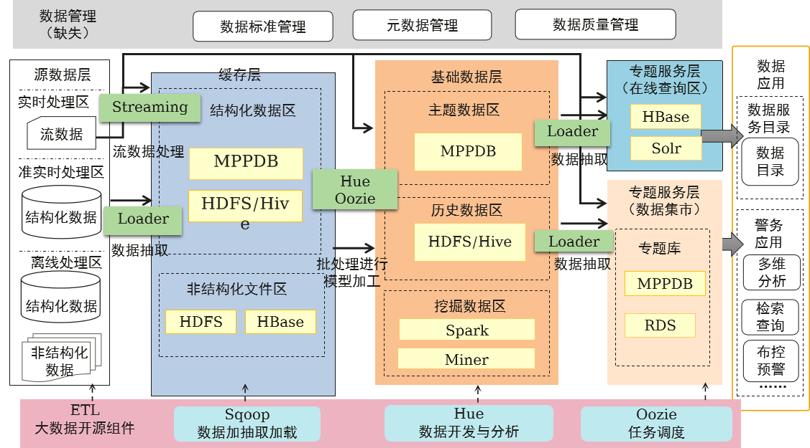

# 华为数据治理中心DataArts Studio

**优势总结：一站式数据治理、作业管理、安全管理、数据服务**

**困难与挑战：**

- 大数据组件众多，集成开发门槛高
- 大量命令行、SQL、Shell脚本散落在各个主机各个系统，缺少统一管控
- Oozie作为调度工具，缺少图形化编排能力，无法支撑复杂业务场景
- 开源大数据组件缺少数据管理能力，对后续数据治理工作带来极大困难
- 资源利用率低，**不足40%**设备更新换代成本高
- 数据模型不统一，难融合接口标准不统一，难对接
- 各类自建系统，能力不共享烟囱式架构，系统缺乏整体提升能力

## 数据治理

- 数据治理是一门将数据视为一项**企业资产**的学科。它涉及到以企业资产的形式**对数据进行优化、保护和利用的决策权利**。它涉及到对组织内的人员、流程、技术和策略的编排，以从**企业数据获取最优的价值**。
- 数据治理的最终目标是提升数据的价值，数据治理非常必要，是企业实现数字战略的基础，它是一个管理体系，包括组织、制度、流程、工具。

**好处**：降低业务运营成本、提升业务处理效率、改善数据质量、控制数据风险、增强数据安全、赋能管理决策

## DataArts Studio

- 华为数据治理中心DataArts Studio是为了应对企业数字化转型挑战，针对企业数字化运营诉求提供的数据全生命周期管理、具有智能数据管理能力的一站式治理运营平台。
- DataArts Studio提供**数据集成、数据开发、规范设计、数据质量监控、数据资产管理、数据服务、数据安全等**功能，支持行业知识库智能化建设，支持**大数据存储、大数据计算分析引擎等**数据底座，帮助企业快速构建从数据接入到数据分析的端到端智能数据系统，消除数据孤岛，统一数据标准，加快数据变现，实现数字化转型。

**数据集成：多种方式异构数据源高效接入**

- 批量数据迁移
  - 批量数据迁移提供20+**同构/异构数据源之间批量数据迁移**的功能，帮助您实现数据自由流动。支持自建和云上的文件系统，关系数据库，数据仓库，NoSQL，大数据云服务，对象存储等数据。
  - 批量数据迁移**基于分布式计算框架**，利用并行化处理技术，支持用户稳定高效地对海量数据进行移动，实现不停服数据迁移，快速构建所需的数据架构。
- 实时数据接入
  - 实时数据接入为处理或分析流数据的自定义应用程序构建数据流管道，主要解决云服务外的数据实时传输到云服务内的问题。实时数据接入每小时可从数十万种数据源（例如**日志和定位日志事件、网站点击流、社交媒体源等**）中连续捕获、传送和存储数TB数据。

**规范设计：数据建模可视化、自动化、智能化**

- DataArts Studio规范设计践行数据治理方法论，将数据治理行为可视化，打通数据基础层到汇总层、集市层的数据处理链路，落地数据标准和数据资产，通过关系建模、维度建模实现数据标准化，通过统一指标平台建设，实现**规范化指标体系，消除歧义、统一口径、统一计算逻辑**，对外**提供主题式数据查询与挖掘服务**。

**数据开发：一站式协同开发平台**

- DataArts Studio数据开发是一个一站式敏捷大数据开发平台，提供可视化的图形开发界面、丰富的数据开发类型（脚本开发和作业开发）、全托管的作业调度和运维监控能力，内置行业数据处理pipeline，一键式开发，全流程可视化，支持**多人在线协同开发**，支持管理**多种大数据云服务**，极大地降低了用户使用大数据的门槛，帮助用户快速构建大数据处理中心。

**数据质量：可控可检验**

- 数据质量模块支持对业务指标和数据质量进行监控，数据质量可检验，帮助用户及时发现数据质量问题。
- **业务指标监控**
  - 业务指标监控是对业务指标数据进行质量管理的有效工具，可以灵活的创建业务指标、业务规则和业务场景，实时、周期性进行调度，满足业务的数据质量监控需求。
- **数据质量监控**
  - 数据质量监控是对数据库里的数据质量进行质量管理的工具，您可以配置数据质量检查规则，在线监控数据准确性。
  - 数据质量可以从**完整性、有效性、及时性、一致性、准确性、唯一性**六个维度进行单列、跨列、跨行和跨表的分析，也**支持数据的标准化**，能够根据数据标准自动生成标准化的质量规则，支持周期性的监控。

**数据资产管理：360度全链路数据资产可视化**

- DataArts Studio提供企业级的元数据管理，厘清信息资产。数据资产管理可视，支持钻取、溯源等。通过数据地图，实现数据资产的数据血缘和数据全景可视，提供数据智能搜索和运营监控。

**数据服务：提升访问查询检索效率**

- DataArts Studio数据服务旨在为企业搭建统一的数据服务总线，帮助企业统一管理对内对外的API服务，支撑业务主题/画像/指标的访问、查询和检索，提升数据消费体验和效率，最终实现数据资产的变现。数据服务为您提供快速将数据表**生成数据API**的能力，同时支持您将现有的**API快速注册到数据服务平台以统一管理和发布**。
- 数据服务采用**Serverless**架构，您只需关注API本身的查询逻辑，无需关心运行环境等基础设施，数据服务会为您准备好计算资源，并支持弹性扩展，零运维成本。

**数据安全：全方位安全保障**

- **网络安全**
  - 基于网络隔离、安全组规则以及一系列安全加固项，实现租户隔离和访问权限控制，保护系统和用户的隐私及数据安全。
- **用户权限策略**
  - 基于角色的访问控制，用户通过角色与权限进行关联，并支持细粒度权限策略，可满足不同的授权需求。针对不同的用户，DataArts Studio提供了**管理者、开发者、运维者、访问者**四种不同的角色，各个角色拥有不同的权限。
- **数据安全**
  - 针对规范设计、数据服务等关键流程，DataArts Studio提供了审核流程。
  - 数据的分级分类管理，数据的全生命周期管理，保证数据的**隐私合规、可回溯**。