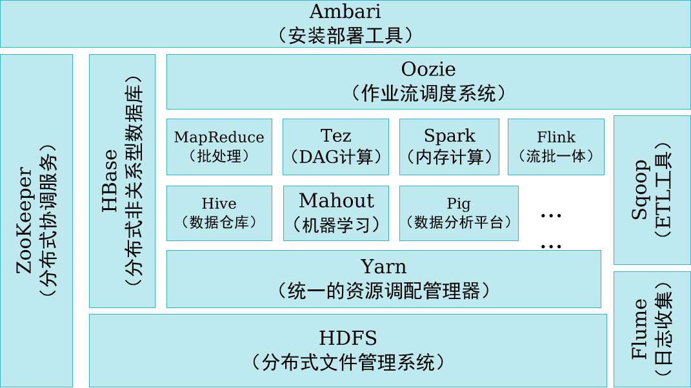

# 大数据发展趋势与鲲鹏大数据

## 1.什么是大数据

**洞见本质、预测趋势、指引未来**

大数据是指利用常用软件工具捕获、管理和处理数据所耗时间超过可容忍时间的数据集。

**云（云计算）大（大数据）物（物联网）智（人工智能）**：开启第四次产业革命，迎接智能时代

#### **从数据库（Database，DB）到大数据（Big Data，BD）** 

|                  | **大数据处理**                                       | **传统数据处理**                   |
| ---------------- | ---------------------------------------------------- | ---------------------------------- |
| 数据规模         | 大（以GB、TB、PB为处理单位）                         | 小 （以MB为处理单位）              |
| 数据类型         | 繁多（结构化、半结构化、非结构化）                   | 单一（结构化为主）                 |
| 模式和数据的关系 | 先有数据后有模式，模式随数据增多不断演变             | 先有模式后有数据（先有池塘后有鱼） |
| 处理对象         | “大海中的鱼”，通过某些“鱼”判断其他种类的“鱼”是否存在 | “池塘中的鱼”                       |
| 处理工具         | No size fits all                                     | One size fits all                  |

#### **大数据应用的主要计算模式**

- **批处理**  一整坨开始一个一个处理
  - 计算针对大规模数据的批量处理。主要技术有MapReduce、Spark等。
- **流计算** 小，但是和流水一下一直工作
  - 针对流数据的实时计算处理。 主要技术有Spark、Storm、Flink、Flume、Dstream等。
- **图计算** 类似与文心一言
  - 针对大规模图结构数据的处理。主要技术有GraphX、Gelly、Giraph、PowerGraph等。
- **查询分析计算** 数据仓库
  - 规模数据的存储管理和查询分析。主要技术有Hive、Impala、Dremel、Cassandra等。

```java
/**
GraphX: Spark内置的图计算算法库。
Gelly：Flink内置图计算算法库。
Giraph：Google 于 2010 年发布的论文Pregel: a system for large-scale graph processing的开源实现。Giraph 是以 Hadoop 为基础开发的上层应用，其系统架构和计算模型与 Pregel 保持了一致。
PowerGraph：分布式图并行计算框架，为了解决Natrural Graph中的“长尾现象”和“幂律分布”问题而提出了节点切分策略。
Impala是Cloudera公司主导开发的新型查询系统，它提供SQL语义，能查询存储在Hadoop的HDFS和HBase中的PB级大数据。相比于Hive，速度更快。
Dremel：谷歌的交互式数据分析系统，同样能提供比Hive更快的速度，可作为Hive和MapReduce的补充。被Impala借鉴。
Cassandra是一套开源分布式NoSQL数据库系统。它最初由Facebook开发，用于储存收件箱等简单格式数据，集GoogleBigTable的数据模型与Amazon Dynamo的完全分布式的架构于一身。
*/
```

#### 大数据的计算任务

- **IO密集型任务**
  - 涉及到网络（5G、6G已经解决）、磁盘、内存（将存储放到内存）IO的任务都是IO密集型任务（IO-Intensive）。
  - **特点**：CPU消耗很少，任务的大部分时间都在等待IO操作完成（因为IO的速度远远低于CPU和内存的速度）。
  - 对于IO密集型任务，任务越多，CPU效率越高，但也有一个限度。常见的大部分任务都是IO密集型任务，比如Web应用。
  - IO密集型任务执行期间，99%的时间都花在IO上，花在CPU上的时间很少，因此提升网络传输效率和读写效率是重中之重。
- **计算密集型任务**
  - 计算密集型任务（CPU-Intensive）的特点：要进行大量的计算，消耗CPU资源。比如计算圆周率、对视频进行高清解码等等，**全靠CPU的运算能力**。
  - 计算密集型任务虽然也可以用**多任务**完成，但是任务越多，花在任务切换的时间就越多，CPU执行任务的效率就越低，所以，要最高效地利用CPU，**计算密集型任务同时进行的数量应当等于CPU的核心数。**
  - 计算密集型任务由于主要消耗CPU资源，因此，代码运行效率至关重要。
- **数据密集型任务**
  - 数据密集型应用（Data-Intensive）与计算密集型应用是存在区别的。
    - 传统的计算密集型应用往往通过并行计算方式在紧耦合的超级计算机上运行少量计算作业，即一个计算作业同时占用大量计算机节点。
    - 数据密集型应用的特点则主要是：
      - 大量独立的数据分析处理作业可以分布在**松耦合**（计算机各干个的事情）的计算机集群系统的不同节点上运行；
      - 高度密集的海量数据I/O吞吐需求；
      - 大部分数据密集型应用都有个数据流驱动的流程。
  - 数据型密集计算的典型应用可概括为以下三类：
    - 日志分析
    - 软件即服务（SaaS）应用
    - 大型企业的商务智能应用

## Hadoop大数据生态圈



|     组件      |     功能     |           备注            |
| :-----------: | :----------: | :-----------------------: |
|     HDFS      |   存储数据   |                           |
|     Yarn      |   资源调配   |      资源：CPU、内存      |
|   MapReduce   |   处理数据   | Tez、Spark、Flink作用相同 |
|     Hive      |   处理数据   |      在MapReduce之上      |
|  Mahout、Pig  |   处理数据   |                           |
|     Hbase     |   存储数据   | 专门为大数据服务的数据库  |
|   Zookeeper   |   协调服务   |                           |
| Flume、sqoop  |   传输数据   |                           |
| Oozie、Ambari | 辅助管理数据 |                           |

# 2.大数据4V特征

- **Volume 体量巨大**
- **Velocity 处理速度快**
- **Variety 类型繁多**
- **Value 价值密度低**  不及时、不连续就会数据报废
- 真实性（第5V）

# 3.大数据的机遇与挑战

|              挑战              |                  机遇                  |
| :----------------------------: | :------------------------------------: |
| **业务部门无清晰的大数据需求** |    **大数据挖掘成为商业分析的核心**    |
|    **企业内部数据孤岛严重**    |   **大数据成为信息技术应用的支撑点**   |
|    **数据可用性低，质量差**    | **大数据成为信息产业持续增长的新引擎** |
|   **数据相关管理技术和架构**   |                                        |
|        **数据安全问题**        |                                        |
|       **大数据人才缺乏**       |                                        |
|    **数据开放与隐私的权衡**    |                                        |

------


